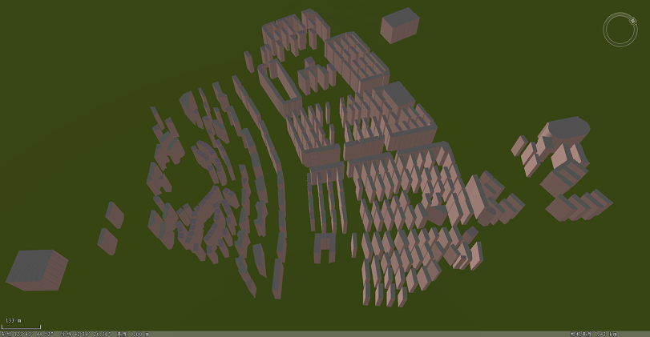

### 使用说明

线性拉伸功能即是对二维或三维面数据进行拉伸建模操作，可实现面对象快速建立三维模型。

本功能适用于二维面数据集、三维面数据集，拉伸建模时，平台可读取面图层的某个属性字段作为拉伸高度、X方向缩放、Y方向缩放的参数取值，实现快速建立三维模型。

### 操作

  1. 在工作空间管理器中右键单击“数据源”，选择 “打开文件型数据源”，打开包含2D/3D面数据集的数据源。
  2. 选择面数据集，右键点击“添加到新球面场景”，在图层管理器中选中面数据集图层，右键单击“快速定位到本图层”。
  3. 单击“ **三维地理设计** ”选项卡的“ **规则建模** ”组中的“ **规则建模** ”下拉按钮，在弹出的下拉菜单中单击“线性拉伸”按钮，弹出“线性拉伸”面板。
  4. 源数据的选择 
      * 打开线性拉伸功能后，如果当前打开的场景中有多个2D/3D面数据集图层，则需要对“源数据”下“对象所在图层”对应的下拉列表中选择需要拉伸对象所在的图层；如果当前场景中只加载了需拉伸对象的数据集图层，则文本框会自动获取该图层。
      * 当图层中有多个面时，我们可以选择“所有对象参与操作”或“只针对选中对象操作”。当图层中只有一个面时，它们功能相同，任选其一。默认选择“只针对选中对象操作”。 
        * 所有对象参与操作：选择该项会将选中图层里的所有面进行拉伸；
        * 只针对选中对象操作：用鼠标左键选中单个面或按住键盘的“Shift”键，配合鼠标左键可选择多个面。
  5. 拉伸对象的参数设置。通过直接输入数值或单击参数右侧按钮实现参数设置。 
      * 拉伸高度：设置面拉伸的高度值，默认拉伸高度20。
      * 底部高程：拉伸对象的底部高程值。
      * X缩放：在X方向的缩放比例，默认数值1。
      * Y缩放：在Y方向的缩放比例。默认数值1。
      * 旋转角度：设置拉伸体的旋转角度，默认值为0。
      * 拆分对象：勾选该项时，将拉伸的闭合模型拆分为三个子对象：底面、顶面以及侧面。
      * 纹理坐标：默认勾选，设置是否按照纹理坐标进行贴纹理。
      * 带LOD：默认勾选，设置是否生成LOD。
  6. 材质设置。单击“材质设置”按钮，弹出“材质编辑”对话框，可以对拉伸体的材质进行编辑，如材质对象，材质颜色，材质纹理及材质纹理实际的横、纵向大小。
  * 对象类型：当勾选“拆分对象”时，对象类型可用，材质对象也分为顶面、底面以及侧面。
      * 材质设置：提供材质颜色和颜色字段两种方式设置材质颜色。选择“材质颜色”是通过弹出的颜色面板进行颜色设置。选择“颜色字段”是通过指定字段进行颜色设置。
      * 纹理设置：提供纹理设置和纹理字段两种方式。选择“纹理设置”是通过选择图片文件指定为纹理所在路径。选择“纹理字段”是选择字段作为纹理字段。 
      * 贴图实际大小：设置贴图重复模式和贴图的横向、纵向大小。当重复模式为实际大小时，贴图的横向、纵向大小单位为米； 当重复模式为重复次数时，贴图的横向、纵向大小单位为次。
      * 单击确定，完成材质设置，返回“线性拉伸”对话框。
  7. 结果数据的存放 
      * 数据源：当工作空间中打开有多个数据源时，需要选择一个数据源存放结果数据。如果只打开了一个数据源，则结果数据默认保存到文本框自动获取的数据源下。
      * 数据集：输入字符串作为结果数据集的名称。
  8. 设置完以上参数，点击“确定”按钮，即可执行线性拉伸操作。会在指定的结果数据源下生成一个与数据集名称命名的模型数据集。

如下图所示为线性拉伸设置多张贴图，勾选“拆分对象”，分别为顶面和侧面设置不同贴图。

  
### 注意事项

  1. 使用线性拉伸功能，需要先打开一个2D/3D面数据集图层。

