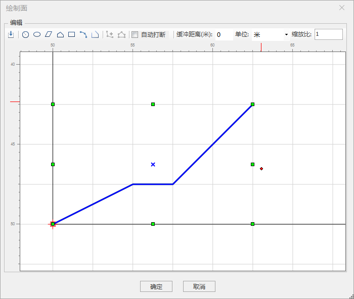

**使用说明**

放样功能实现三维线转换成闭合模型，其中模型截面样式依据绘制的截面图和自定义的材质设置。放样对象可以是选中的三维线或整个图层中所有的三维线。

**操作步骤**

  1. 在工作空间管理器中右键单击“数据源”，打开包含线数据集的数据源。选择进行放样操作的线数据集，添加到球面场景并定位到该图层。
  2. 在“ **三维地理设计** ”选项卡下的“ **规则建模** ”组中单击“放样”按钮，弹出“放样”操作对话框，如下图所示：  
  

  3. 源数据的选择 
       * 打开放样功能后，如果当前打开的场景中有多个线数据集图层，则需要对“源数据”下的“对象所在图层”进行选择。单击“对象所在图层”组合框下拉箭头，选择需要进行放样操作的线数据集图层。默认情况下，对象所在图层文本框自动获取最顶端的图层。
       * 当图层中有多条线时，需要进行对象操作选择：所有对象参与操作、只针对选中对象操作。当图层中只有一条线时，“所有对象参与操作”和“只针对选中对象操作”功能一致，任选其一。默认选择“所有对象参与操作”。 
  4. 参数设置： 
    * 点击“绘制”按钮，绘制放样模型的截面形状，弹出“绘制面”对话框，如下图所示：  
    
“绘制面”对话框中包含编辑横截面的绘图工具。选择对应工具，在对话框中间绘图区间进行绘制，绘图完成，单击“确定”按钮。

      * 截面的平滑程度可以自定义，手动输入平滑程度数值或通过上下箭头进行调整。默认平滑程度为50。
      * 倒角样式包括圆弧和椭圆弧，单击“倒角样式”组合框的下拉箭头，进行样式选择。默认倒角样式为圆弧。
  5. 材质设置： 单击“材质设置”按钮，弹出“材质编辑”对话框，具体操作可以参照帮组文档“线性拉伸”的材质设置操作。 
  6. 结果设置： 
       * 当工作空间中包含多个数据源，需要选择一个数据源来存放结果数据。如果只打开了一个数据源，则结果数据默认保存到文本框自动获取的数据源下。
       * 数据集名称：默认数据集名称为BuilderResult。可自行定义，输入字符串作为结果数据集的名称。
  7. 单击“确定”按钮，完成线对象的放样操作。在指定的结果数据源下生成一个以数据集名称命名的模型数据集。示范放样效果图如下图所示：  
  
  
**注意事项**

  1. 图层中加载有三维线时，放样可用。
  2. 按住“Shift”键实现对多条三维线的选择。

 

