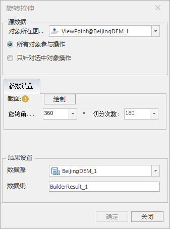
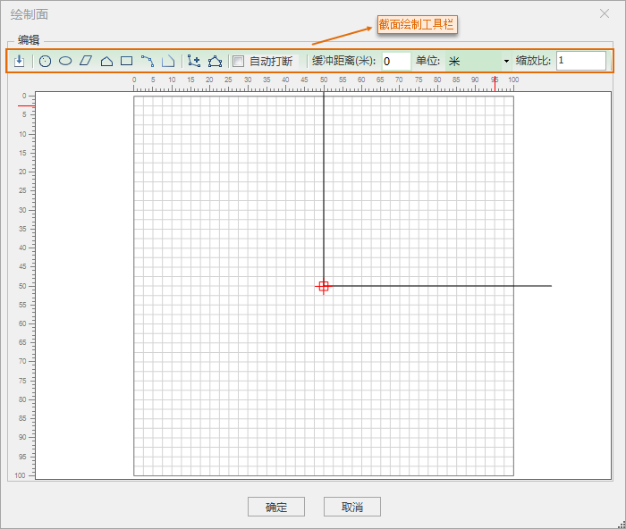
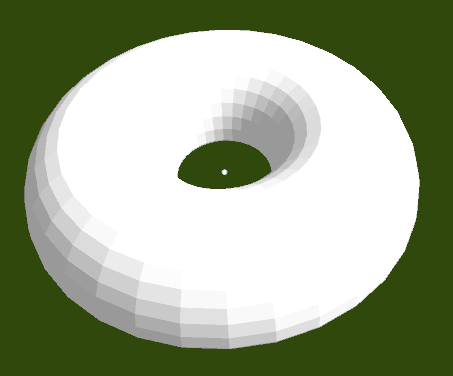

### 使用说明

旋转拉伸功能即是对三维点数据进行拉伸建模操作，可实现点对象快速建立三维模型。

本功能适用于三维点数据集，拉伸建模时，平台根据绘制的不同截面和旋转角度，实现快速建立形态不一的三维模型。

### 操作步骤

  1. 在工作空间管理器中右键单击“数据源”，选择 “打开文件型数据源”，打开包含3D点数据集的数据源。
  2. 选择点数据集，右键点击“添加到新球面场景”，在图层管理器中选中点数据集图层，右键单击“快速定位到本图层”。
  3. 单击“ **三维地理设计** ”选项卡的“ **规则建模** ”组中的“ **拉伸** ”下拉按钮，在弹出的下拉菜单中单击“旋转拉伸”按钮，弹出“旋转拉伸”面板。如下图所示:  
  

  4. 源数据的选择 
       * 打开旋转拉伸功能后，如果当前打开的场景中有多个3D点数据集图层，则需要对“源数据”下“对象所在图层”对应的下拉列表中选择需要拉伸对象所在的图层；如果当前场景中只加载了需拉伸对象的数据集图层，则文本框会自动获取该图层。
       * 当图层中有多个点时，我们可以选择“所有对象参与操作”或“只针对选中对象操作”。当图层中只有一个点时，它们功能相同，任选其一。默认选择“只针对选中对象操作”。 
         * 所有对象参与操作：选择该项会将选中图层里的所有点进行拉伸；
         * 只针对选中对象操作：用鼠标左键选中单个点或按住键盘的“Shift”键，配合鼠标左键可选择多个点。
  5. 拉伸对象的参数设置 
       * 截面：绘制截面形状。单击“绘制”按钮，弹出“绘制面”对话框，借助截面绘制工具栏进行截面绘制，所绘结果支持滚动鼠标滑轮缩放查看，如下图所示：  
     

       * 导入：导入数据集作为截面。单击“导入”按钮弹出“选择对话框”，框内为工作空间内数据源下所有数据，可以选择已有数据也可以新建数据集进行添加，但只支持平面坐标系的数据。
       * 还可通过工具栏中“圆”、“椭圆”、“平行四边形”、“多边形”、“矩形”、“圆弧”以及“线”等按钮绘制截面形状。
       * 鼠标左键单击绘制截面可以进行截面编辑，工具栏中的“添加节点”和“编辑节点”按钮激活。自行设置截面形状。
       * 缩放比：默认为1，会实时缩放至原始图形的倍数。但缩放的比例不宜过大，以免图形缩放后超过绘制面板无法实现旋转拉伸的效果。绘制的截面大小有限制，不宜超过绘制面板。
       * 缓冲距离：设置旋转拉伸后的模型距离三维点的距离，没有正负数值的区分，默认为0，默认单位为米，单击单位右侧下拉按钮可选择不同的单位，如厘米，英尺等。
       * 旋转角度：设置拉伸体的旋转角度。
       * 切分次数：设置旋转角度的切分次数，将旋转角度等分。默认切分次数是旋转角度的一半。
  6. 结果数据的存放 
       * 数据源：当工作空间中打开有多个数据源时，需要选择一个数据源存放结果数据。如果只打开了一个数据源，则结果数据默认保存到文本框自动获取的数据源下。
       * 数据集名称：默认为BuilderResult。也可自行定义，输入字符串作为结果数据集的名称。
  7. 设置完以上参数，点击“确定”按钮，即可执行旋转拉伸操作。会在指定的结果数据源下生成一个与数据集名称命名的模型数据集。示例效果图如下：  
  

  
**注意事项**

 1. 使用旋转拉伸功能，需要先打开一个3D点数据集图层。
 2. 截面不支持跨Y轴面，无法绘制，导入面跨Y轴需编辑处理

 

