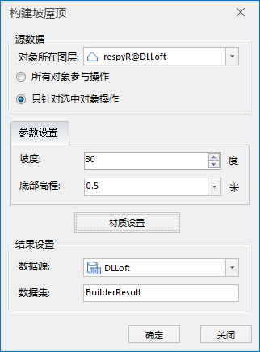
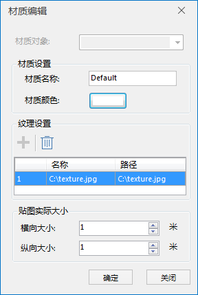
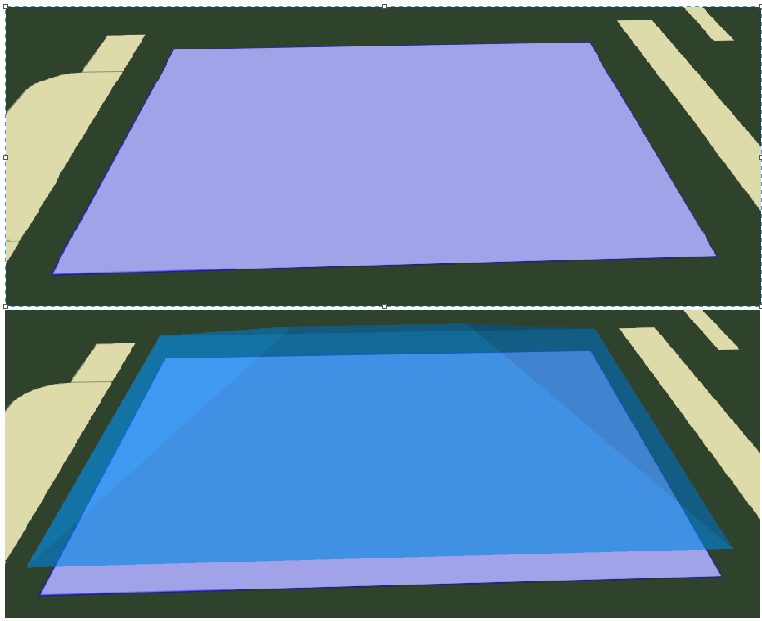

**使用说明**

由多边形坡屋顶构建闭合模型，坡屋顶对象为（选中或整个图层）多边形，支持二三维面图层（地理坐标系下）。

**操作步骤**

  1. 在工作空间管理器中右键单击“数据源”，打开包含2D/3D面数据集的数据源。将面数据集添加到场景中，并定位到该图层。
  2. 在“ **三维地理设计** ”选项卡下的“ **规则建模** ”组中单击“构建坡屋顶”按钮，弹出“构建坡屋顶”对话框。如下图所示：  
  

  3. 源数据的选择 
       * 打开构建坡屋顶功能后，如果当前打开的场景中有多个2D/3D面数据集图层，则需要对“源数据”下“对象所在图层”对应的下拉列表中选择需要操作面对象所在的图层；文本框会自动获取最顶端的图层。
       * 当图层中有多个面时，我们可以选择“所有对象参与操作”或“只针对选中对象操作”。当图层中只有一个面时，它们功能相同，任选其一。默认选择“只针对选中对象操作”。 
         * 选择该项会将选中图层里的所有面进行构建坡屋顶操作；
         * 用鼠标左键选中单个面或按住键盘的“Shift”键，配合鼠标左键可选择多个面。
  4. 参数设置：设置坡屋顶对象的坡度及底部高程，坡度单位为度，底部高程单位为米。
  5. 材质设置：单击“材质设置”按钮，弹出材质编辑对话框，如下图所示：  
  
 
       * 材质设置：包括设置材质名称和材质颜色。单击“材质颜色”处的白底框，在弹出的颜色面板中进行颜色的选择。
       * 纹理设置：包括纹理的添加和删除。单击“+”号指定纹理所在路径，添加纹理。选中列表中的某一纹理，单击删除图标，删除纹理。
       * 贴图实际大小设置：设置贴图的横向和纵向大小，单位为米。
       * 单击“确定”按钮，完成材质设置，返回“构建坡屋顶”对话框。
  6. 结果数据的存放 
       * 当工作空间中打开有多个数据源时，需要选择一个数据源存放结果数据。如果只打开了一个数据源，则结果数据默认保存到文本框自动获取的数据源下。
       * 数据集名称：输入字符串作为结果数据集的名称。
  7. 点击“确定”按钮，完成坡屋顶的构建。在指定的结果数据源下生成一个以数据集名称命名的模型数据集。  
    
  
**注意事项**

 1. 图层中加载有二、三维面图层时，构建坡屋顶可用。

 

