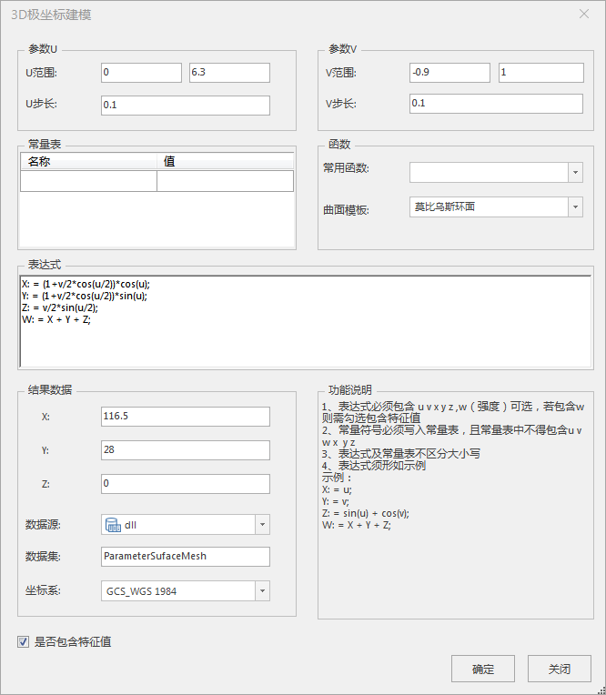
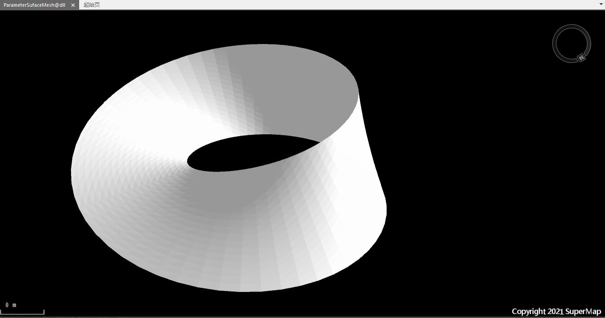

### 使用说明

3D极坐标建模功能实现根据UV参数和数学表达式，构建包括球面、抛物面、双曲抛物面、柱面、圆锥面、莫比乌斯环面、螺旋面、螺旋环面以及Roman曲面等多种3D曲面模型。

### 操作步骤

  1. 在工作空间管理器中右键单击“数据源”，打开或新建一个文件型数据源。
  2. 单击“ **三维地理设计** ”选项卡的“ **规则建模** ”组中的“ **3D极坐标建模** ”，弹出“3D极坐标建模”对话框。如下图所示：     
     
  3. 函数 
      * 常用函数：提供了很多平常使用到的函数类型，方便书写数学表达式时使用。
      * 曲面模板：当前提供了包括球面、抛物面、双曲抛物面、柱面、圆锥面、莫比乌斯环面、螺旋面、螺旋环面以及Roman曲面等多种3D曲面模板。 
        * 选择不同的曲面模板，会在表达式的文本域中给出对应的数学表达式。
        * 数学表达式的书写方式需要参照“3D极坐标建模”对话框右下角，功能说明的示例进行书写。
  4. 参数设置：包括设置U、V的范围和步长还有常量符号。 
      * 参数U、V：设置u、v的范围及步长。
      * 常量表：记录了表达式中的一些常量符号，常量符号必须写入常量表，且常量表中不得包含u、v、w、x、y、z。常量不可和变量重名，不区分大小写。
  5. 结果数据 
      * 插入点坐标：自定义xyz的值，默认x，y，z为（0,0,0）。
      * 数据源：通过下拉选择目标数据源，默认加载当前工作空间里的第一个数据源。
      * 数据集：输入字符串作为结果数据集的名称，默认为ParameterSufaceMesh。
      * 坐标系：设置目标数据的坐标系。
  6. 功能说明：标明了书写数学表达式的注意事项及示例。
  7. 是否包含特征值：默认勾选，特征值可用于表达异于其他事物的特点。
  8. 点击“确定”按钮，完成3D极坐标建模。在指定的结果数据源下生成一个以数据集名称命名的模型数据集。
    
  
### 注意事项

  1. 工作空间管理器中需要打开数据源，3D极坐标建模功能可用。
  2. 需要按照功能说明中的示例进行书写表达式。

