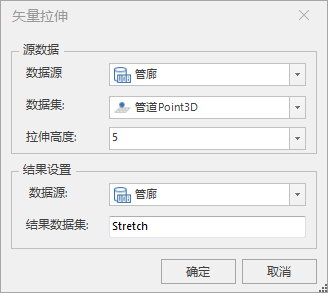
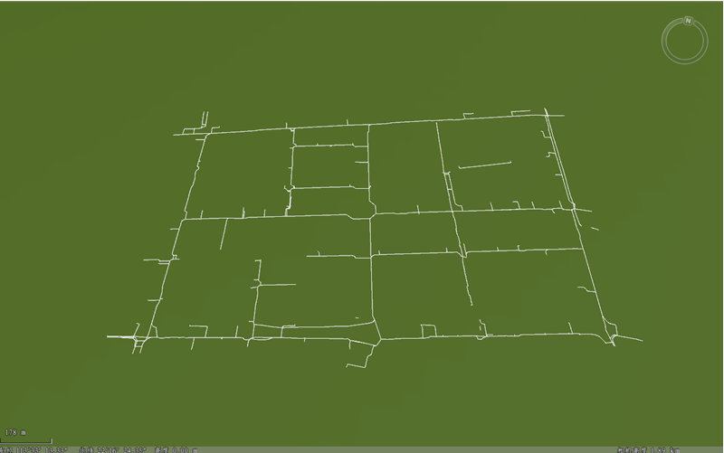
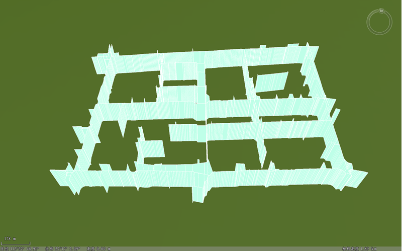

### 使用说明

矢量拉伸功能是对二三维点、线数据进行拉伸操作，即将点对象拉伸成线对象，线对象拉伸成面对象。

本功能适用于二三维点、线数据集，拉伸建模时，支持设置点、线图层的某个属性字段作为拉伸高度，也可以输入数值作为拉伸高度。

### 操作步骤

  1. 在工作空间管理器中右键单击“数据源”，选择 “打开文件型数据源”，打开包含二三维点、线数据集的数据源。
  2. 选择点或线数据集，右键点击“添加到新球面场景”，在图层管理器中选中面数据集图层，右键单击“快速定位到本图层”。
  3. 单击“ **三维地理设计** ”选项卡的“ **规则建模** ”，在弹出的下拉菜单的“ **规则建模** ”组中单击“ **矢量拉伸** ”按钮，弹出“矢量拉伸”面板。如下图所示:  
  
  4. 源数据： 
      * 数据源：单击右侧下拉框按钮，选中二三维点、线数据集所在的数据源。打开矢量拉伸功能后，如果当前打开的场景中有多个二三维点、线数据集图层，则需要对“源数据”下“对象所在图层”对应的下拉列表中选择需要拉伸对象所在的图层；如果当前场景中只加载了需拉伸对象的数据集图层，则文本框会自动获取该图层。
      * 数据集：右侧下拉框内列出了所选数据源下的所有二三维点、线数据集。
      * 拉伸高度：设置面拉伸的高度值，通过直接输入数值或单击参数右侧按钮实现参数设置，默认拉伸高度5。输入数值为正时，向上拉伸；输入数值为负时，向下拉伸。
  5. 结果设置： 
      * 数据源：选择一个数据源存放结果数据。如果只打开了一个数据源，则结果数据默认保存到文本框自动获取的数据源下。
      * 数据集名称：输入字符串作为结果数据集的名称。
  6. 设置完以上参数，点击“确定”按钮，即可执行矢量拉伸操作。会在指定的结果数据源下生成一个以数据集名称命名的模型数据集。

   下图所示为以线数据集为例进行矢量拉伸。

  
---  
 
  
---  

  
### 注意事项

    1. 矢量拉伸功能，只能沿Y轴拉伸。

