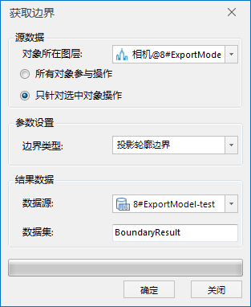

### 使用说明

去除孤立三角片和孔洞修补,然后提取模型上边界点并使用三次非均匀B样条曲线拟合边界线,通过累加弦长参数法计算边界线的长度,最后采用平行切面投影边界面的方法,
用三角剖分得到延展的边界曲面。提取边界主要用于道路、护坡。

### 操作步骤

  1. 打开包含模型数据集的数据源，将模型数据集添加到球面场景中，选中图层管理器中的模型数据集图层，右键单击“快速地定位到本图层”。
  2. 单击“ **三维地理设计** ”下的“ **模型操作** ”组的“ **截面与投影** ”下拉按钮，在下拉菜单中单击“提取边界”项，弹出“获取边界”对话框。如下图所示：       
  
  3. 选择需要提取边界的模型对象所在图层。 
  * 对象所在图层：下拉选择一个模型数据集图层；
  * 操作对象：可选择图层的所有模型对象或图层中被选中的模型进行操作。 
    * 所有对象参与操作：选择该项会将选中图层里的所有模型对象提取出边界面；
    * 用鼠标左键选中单个模型对象或按住键盘的“Shift”键，配合鼠标左键可选择多个模型对象。
  4. 设置边界类型：可以提取模型的三角网边界面或投影轮廓边界面。 
  * 三角网边界面：模型边界一系列连续三角形网状图形。
  * 投影轮廓边界面：模型在投影轮廓边界处的几何面。
  5. 结果数据：设置结果数据的存放信息。 
  * 数据源：设置结果数据集存放数据源。
  * 数据集名称：数据集名称默认为BoundaryResult。可自行定义，输入字符串作为结果数据集的名称。
  6. 设置完以上参数，点击“确定”按钮，在指定的结果数据源下生成一个以结果数据集名称命名的三维面数据集。

    获取边界操作成功后，将在指定的结果数据源下生成一个三维矢量面数据集，将该矢量面添加到场景中浏览。

### 注意事项

  1. 提取边界操作仅针对模型数据集，将模型数据集添加到球面场景中，该功能将被激活。

