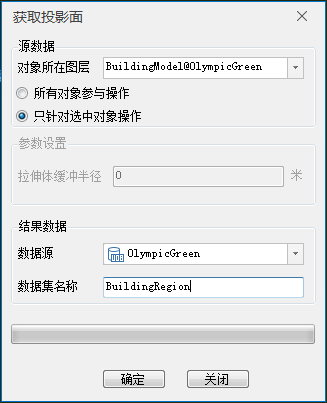
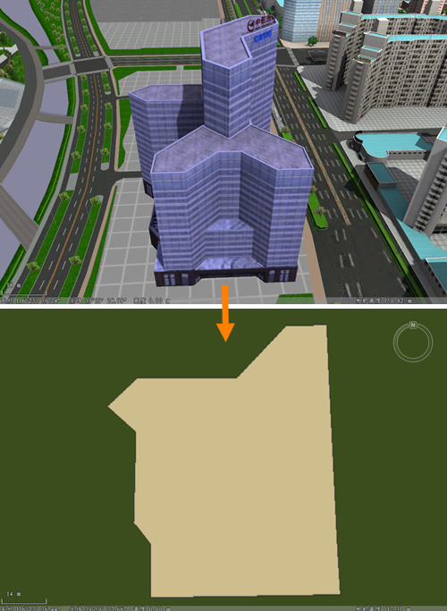

### 使用说明

投影面功能即是将三维模型对象投影到XY（二维）平面上，生成二维面对象，此二维面对象相当于模型的俯视图。

### 操作步骤

  1. 打开包含模型数据集的数据源，将模型数据集添加到球面场景中。
  2. 单击“ **三维地理设计** ”下的“ **模型操作** ”组的“ **截面与投影** ”下拉按钮，在下拉菜单中单击“投影面”项，弹出“获取投影面”对话框，如下图所示：       
 
  3. 源数据：设置用于获取投影面的模型对象。 
  * 对象所在图层：下拉选择一个模型数据集图层；
  * 操作对象：可选择图层的所有模型对象或图层中被选中的模型进行操作。 
    * 所有对象参与操作：即图层的所有模型对象都将生成投影面；
    * 只针对选中对象操作：即图层中仅被选中的模型将生成投影面，勾选此项需确保场景中已有模型对象被选中，通过鼠标左键选中单个模型或按住键盘的“Shift”键，配合鼠标左键可选择多个对象。
  4. 结果数据：设置结果数据的存放信息。 
  * 数据源：设置结果数据集存放数据源。
  * 数据集名称：数据集名称默认为PrjRegionResult。可自行定义，输入字符串作为结果数据集的名称。
  5. 设置完以上参数，点击“确定”按钮，即可执行获取投影面操作。

获取投影面操作成功后，将在指定的结果数据源下生成一个二维矢量面数据集，将该矢量面添加到场景中浏览，图示为对一个模型对象生成投影面的操作结果。  

  

### 注意事项

  1. 投影面操作仅针对模型数据集，将模型数据集添加到球面场景中，该功能将被激活。

