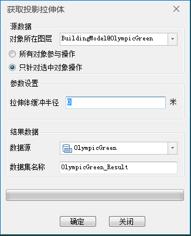
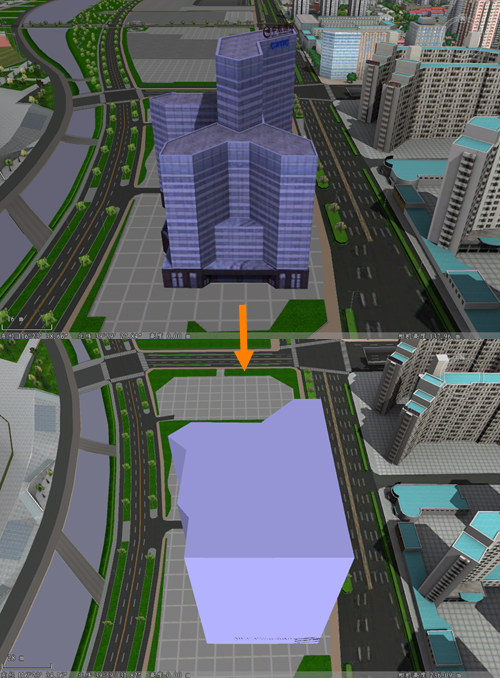

### 使用说明

投影拉伸体功能相当于对模型对象进行了获取投影面和线型拉伸两重操作，其中投影面为模型对象最小高度的平面，再对投影面进行线型拉伸操作，拉伸高度为模型高度。通过投影拉伸体操作，可以获得完全包络原模型对象的模型。

### 操作步骤

  1. 打开包含模型数据集的数据源，将模型数据集添加到球面场景中。
  2. 单击“ **三维地理设计** ”下的“ **模型操作** ”组的“ **截面与投影** ”下拉按钮，在下拉菜单中单击“投影拉伸体”项，弹出“获取投影拉伸体”对话框，如下图所示：  
  
 
  3. 源数据：设置用于获取投影面的模型对象。 
  * 对象所在图层：下拉选择一个模型数据集图层；
  * 操作对象：可选择图层的所有模型对象或图层中被选中的模型进行操作。 
    * 所有对象参与操作：即图层的所有模型对象都将进行投影拉伸体操作；
    * 只针对选中对象操作：即图层中仅被选中的模型将进行投影拉伸体操作，勾选此项需确保场景中已有模型对象被选中，通过鼠标左键选中单个模型或按住键盘的“Shift”键，配合鼠标左键可选择多个对象。
  4. 参数设置：设置拉伸体缓冲半径。 
  * 拉伸体缓冲半径：默认为0；若设置为大于0的数值，生成的拉伸体将向外围延伸扩大此半径值。
  5. 结果数据：设置结果数据的存放信息。 
  * 数据源：设置结果数据集存放数据源。
  * 数据集名称：数据集名称默认为ExtrudeBodyResult。可自行定义，输入字符串作为结果数据集的名称。
  6. 设置完以上参数，点击“确定”按钮，即可执行投影拉伸体操作。获取投影拉伸体操作成功后，将在指定的结果数据源下生成一个模型数据集，将该模型数据集添加到球面场景中浏览，图示为一个模型对象生成投影拉伸体的结果。  

    

### 注意事项

  1. 投影拉伸体操作仅针对模型数据集，将模型数据集添加到球面场景中，该功能将被激活。

