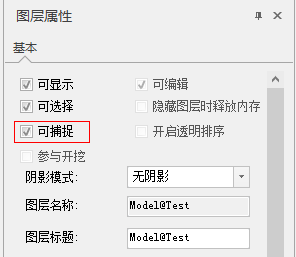
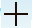
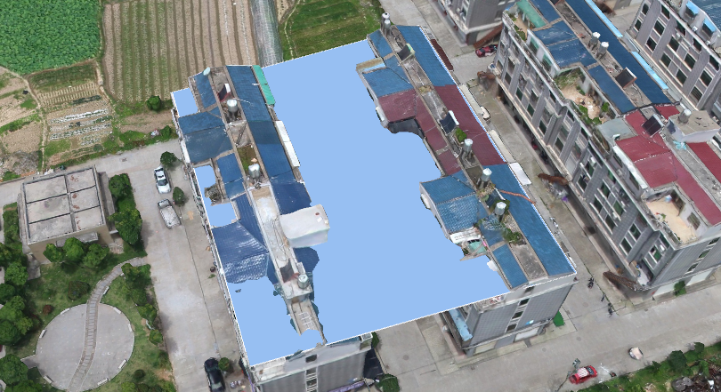

**使用说明**

对倾斜摄影模型和BIM模型支持顶点捕捉，便于在数据上进行操作。

**操作步骤**

  1. 打开倾斜摄影模型或BIM模型的“图层属性”面板，勾选“可捕捉”。
   

  2. 在场景中对倾斜数据进行处理，如要在倾斜模型上绘制一个面。
  3. 在场景中添加一个面图层，并且开启图层可编辑。在倾斜模型上绘制面时，自动捕捉顶点。当鼠标中心处的点变为蓝色时，表示捕捉顶点成功；点为红色表示没有拾取到顶点。示例数据进行顶点捕获获取的面，如下图所示：  
  

 

 

