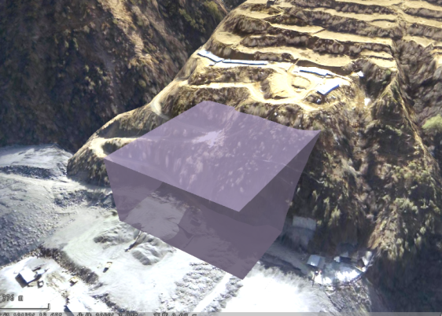
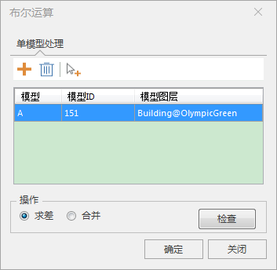
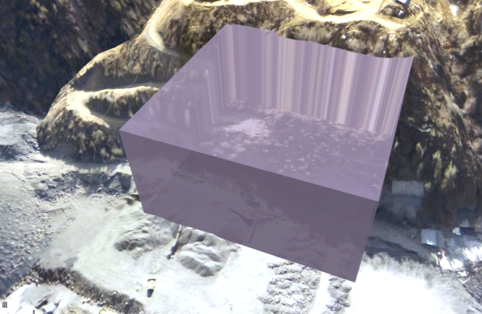

### 使用说明

“布尔运算”功能是在场景中将TIN地形与模型数据进行求差运算或合并运算，得到新的TIN地形数据。

目前只支持单模型的布尔运算。

### 操作步骤

  1. 加载数据源。数据源需要包含模型数据集和TIN地形数据。添加到场景中的示范效果如下：       
  
  2. 打开布尔运算窗口。在“ **三维地理设计** ”选项卡中“ **TIN地形操作** "中，单击“布尔运算”按钮，弹出布尔运算对话框如下：    
     
 
  3. 添加、删除或拾取与TIN地形进行布尔运算的模型数据。
  4. 选择布尔运算操作。布尔运算包含求差和合并，单选进行的布尔运算操作。
  5. 单击“检查”按钮，对需参与布尔运算的模型的闭合性进行检查，若模型闭合，输出窗口显示“模型1三角网拓扑结构满足布尔运算的条件!”，反之，则会在输出窗口显示“模型“1”三角网拓扑结构不满足布尔运算的条件，请尝试执行移除重复点、对象拆分等操作对模型处理后再执行布尔运算！”。
  6. 点击“确定“进行布尔运算。示例数据求差的运算结果如下：  
      

### 注意

  1. 参与布尔运算的模型和TIN地形的坐标系单位应保持一致。若不一致，运算失败且会在输出窗口显示“请确认目标坐标系的单位是否一致”。

