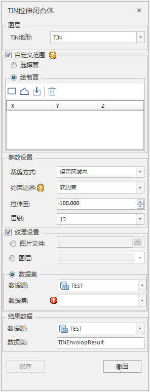

### 使用说明

“拉伸闭合体”功能是对TIN地形向上拉伸至指定高程处,形成一个闭合体。该方法可以用于3D打印的实体模型构建。

### 操作步骤

  1. 新建一个球面场景。在工作空间管理器中右键单击“场景”，选择 “新建球面场景”。
  2. 添加TIN地形缓存数据。在图层管理器中右键单击“地形图层”，选择“添加地形缓存…”，指定TIN地形数据存储路径，实现加载TIN地形数据。
  3. “ **三维地理设计** ”选项卡中“ **TIN地形操作** ”中，单击“拉伸闭合体”按钮，弹出“拉伸闭合体”面板，如下图所示：       
    
  4. 图层选择 
  * 打开拉伸闭合体功能后，如果当前打开的场景中有多个地形图层，鼠标单击TIN地形右侧的组合框的下拉箭头选择需要进行操作的TIN地形所在的对象图层；如果当前场景中只加载了需进行拉伸闭合体对象的数据集图层，则文本框会自动获取该图层。
  5. 拉伸范围设置 
  * 默认勾选“自定义范围”，自行设置拉伸闭合体范围，否则使用TIN地形的默认范围。
  * 拉伸范围自定义：拉伸范围可以通过“选择面”或“绘制面”进行确定，其中绘制面提供矩形、多边形、导入和移除功能。
  6. 拉伸对象的参数设置 
  * 裁剪方式：包括保留区域内和保留区域外，默认为保留区域内。
  * 约束边界：包括硬约束和软约束，默认为软约束。
  * 拉伸至：输入拉伸高度值或通过上下箭头调整拉伸高度值。
  * 层级：输入层级参数，仅对输入的层级进行拉伸处理。
  7. 纹理设置
  * 图片文件：选择图片文件指定为纹理所在路径。
  * 图层：选择影像图层作为纹理。
  8. 结果数据的存放 
  * 数据源：自动生成“临时数据”数据源。
  * 数据集名称：输入字符串作为结果数据集的名称。
  9. 设置完以上参数，点击“保存”按钮，即可执行TIN地形拉伸闭合体操作。会在指定的结果数据源下生成一个与数据集名称命名的模型数据集。示例效果图如下：
 
### 注意事项

  1. 操作拉伸闭合体前必须存在打开的数据源。
  2. 拉伸闭合体支持模型数据集。
  3. 拉伸闭合体支持撤回操作。

