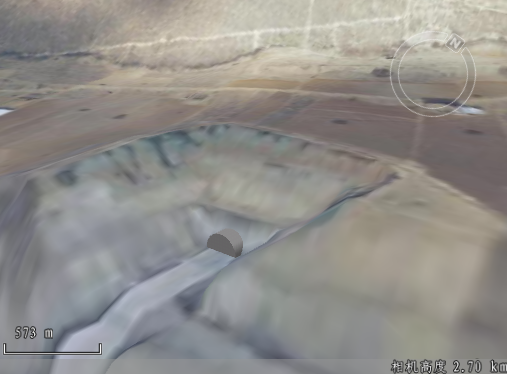
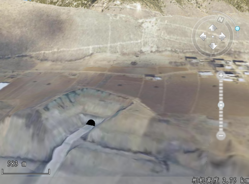

**使用说明**

“表面运算”功能是在场景中将TIN地形与模型数据进行表面求差运算或表面合并运算，得到新的TIN地形数据。

目前只支持单模型的表面运算。

**使用场景**

该功能可用于道路与隧道工程等领域。

**操作步骤**

  1. 加载数据源。数据源需要包含模型数据集和TIN地形数据。添加到场景中的示范效果如下：  
      
 

  2. 打开表面运算窗口。在“ **三维地理设计** ”选项卡中“ **TIN地形操作** "中，单击“表面运算”按钮，弹出表面运算对话框。
  3. 添加、删除或拾取与TIN地形进行表面运算的模型数据。按钮表示添加模型数据，按钮表示删除模型数据，按钮表示拾取模型数据。
  4. 单击“检查”按钮，检查参与运算的模型的三角网拓扑结构是否满足表面运算的条件。如果不满足则会在输出窗口显示提示信息，需要进行相关操作后再重新进行表面运算。反之，则会在输出窗口提醒显示“模型三角网拓扑结构满足运算的条件!”
  5. 选择表面运算操作。表面运算包含求差和合并，单选进行的表面运算操作。
  6. 点击“确定“进行表面运算。示例数据求差的运算结果如下：   
    

 

**注意**

  1. 参与表面运算的模型和TIN地形的坐标系单位应保持一致。若不一致，运算失败且会在输出窗口显示“请确认目标坐标系的单位是否一致”。

 

