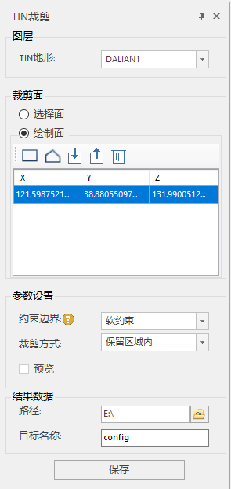

**使用说明**

为了配合DEM生成TIN地形缓存的使用，对TIN地形缓存数据进行多种形式的裁剪操作，更好的利用数据。通过指定的范围对场景窗口中的指定TIN地形进行区域裁剪。

**操作步骤**

  1. 在场景中加载TIN地形缓存（文件格式为*.sct）。单击“ **场景** ”选项卡中“ **数据** ”组内的“ **缓存** ”下拉按钮下的“打开缓存”按钮，添加地形缓存。或者在图层管理器中，鼠标右键单击“地形图层”，选择菜单列表中添加地形缓存。操作示范如下    
     

  2. 在图层管理器中选中地形缓存图层，右键单击“快速定位到本图层”，在场景窗口按住鼠标滚轮将相机调整至便于裁剪模型的视角。
  3. 在“ **三维地理设计** ”选项卡中“ **TIN地形操作** ”中，单击“裁剪”项，弹出“TIN裁剪”面板，如下图所示：    
     
       * 图层选择：单击“Tin地形”组合框的下拉箭头，选择需裁剪对象所在的图层。
       * 裁剪面确定：单选“选择面”或“绘制面”确定裁剪面类型。当选择“绘制面”，工具栏提供了“矩形”、“多边形”和“导入”三种方法进行裁剪面的绘制，其中导入按钮单击后弹出的对话框，如下图所示。     
  

      * 参数设置：单击“裁剪方式”组合框的下拉箭头，选择“保留区域内”或“保留区域外”一种裁剪方式。保留区域内裁剪方式是裁剪获取封闭区域内的TIN地形缓存，保留区域外裁剪方式是裁剪获取封闭区域外的TIN地形缓存。单击“约束边界”组合框的下拉箭头，选择“软约束”或“硬约束”一种约束方式。软约束是裁剪结果边界高程值和原来一致，保持不变；硬约束是裁剪结果边界高程和裁剪面边界高程值一致。
  4. 单击“确定“进行TIN地形缓存裁剪。

**注意事项**

  1. 在SuperMap iDesktop软件上对TIN地形操作后，能保留历史记录。点击“TIN裁剪”对话框中的“撤回”按钮，能回滚到离当前时间节点最近一次操作的历史记录处。

 

