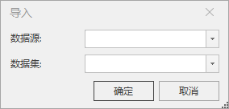

**使用说明**

在TIN地形上镂空一个洞，三维模型叠加显示，形成模型与地形匹配的效果。

**操作步骤**

  1. 在场景中加载TIN地形缓存（文件格式为*.sct）。在图层管理器中，鼠标右键单击“地形图层”，选择菜单列表中添加地形缓存。操作示范如下    
     

  2. 在“ **三维地理设计** ”选项卡中“ **TIN地形操作** ”中，单击“挖洞”项，弹出“TIN挖洞”面板，如下图所示：    
     

     - 图层选择：单击“Tin地形”组合框的下拉箭头，选择需挖洞对象所在的图层。
     - 挖洞面确定：单选“选择面”或“绘制面”确定挖洞面类型。当选择“绘制面”，工具栏提供了“矩形”、“多边形”和“导入”三种方法进行镶嵌面的绘制.
       * 矩形挖洞：鼠标左键单击“矩形挖洞”按钮，在场景中Tin地形上绘制需要挖洞的矩形区域。
       * 多边形挖洞：单击“多边形挖洞”按钮，在场景中Tin地形上绘制需要挖洞的多边形区域。
       * 选中对象区域挖洞：选择单个或多个二、三维面对象进行挖洞。SuperMap建议:先选择面对象，再单击“选中对象区域挖洞”按钮。
       * 导入按钮单击后弹出的对话框，如下图所示：  
   

  3. 点击“确定”按钮完成操作。效果图如下所示：   
     

**注意事项**

  1. Tin地形挖洞默认保留区域外的数据。
  2. 撤销：在SuperMap iDesktop软件上对TIN地形操作后，能保留历史记录。撤销能回滚到离当前时间节点最近一次操作的历史记录处。

 

