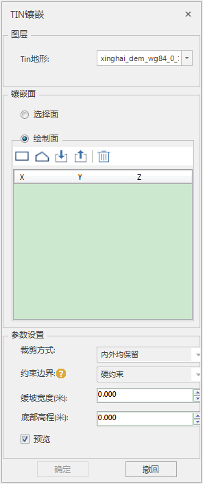
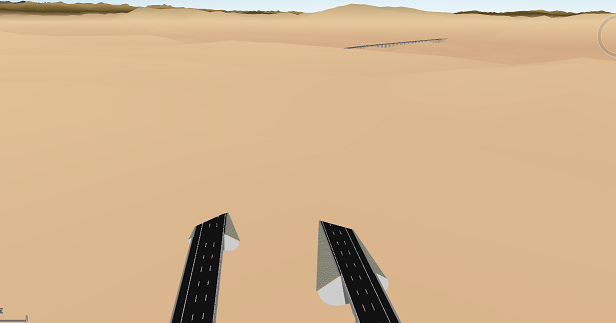
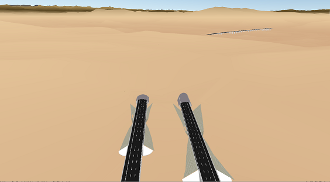

**使用说明**

对已有的地形数据与模型之间不能严格的匹配上，存在公路、护坡被地形压盖或隧道洞口处被地形遮挡等问题。

可通过TIN地形-镶嵌功能，利用模型的边界面与TIN地形进行镶嵌，使地形与模型能够很好的贴合。

当场景窗口中存在TIN地形时，通过多边形对球面场景中指定地形进行镶嵌。被镶嵌地形为TIN地形，镶嵌图层支持二三维面图层。

**操作步骤**

  1. 利用“ **三维地理设计** ”选项卡中的“ **模型操作** ”组中" **截面与投影** "下拉按钮中的“提取边界”功能，提取被地形压盖或遮挡的模型边界面。具体操作，请参考[“提取边界”](../SectionAndProjection/ExtractBoundary  l)窗口。
  2. 将获取到的面数据集添加到场景中，选择与地形进行镶嵌的面对象有多种方法，以下列举一种对于面对象较多的情况： 在“ **三维地理设计** ”选项卡下的“ **TIN地形操作** ”组中，单击“镶嵌”项，弹出“TIN镶嵌”面板。   
     
 
       * 图层选择：单击“TIN地形”组合框的下拉箭头，选择需镶嵌对象所在的图层。
       * 镶嵌面确定：单选“选择面”或“绘制面”确定镶嵌面类型。当选择“绘制面”，工具栏提供了“矩形”、“多边形”和“导入”三种方法进行镶嵌面的绘制，其中导入按钮单击后弹出的对话框，如下图所示。  
   

  3. 参数设置，包括设置护坡宽度和是否勾选“预览”复选框。 
       * 缓坡宽度：默认为0，单位为米。直接输入数值或通过右侧的上下箭头调数值，确定护坡的宽度。
       * 底部高程：设置镶嵌面的底部高程，这个操作不会改变镶嵌面的原始值。默认为0，单位为米。直接输入或者通过右侧的上下箭头调整数值，确定底部高程。
       * "预览"复选框：默认勾选“预览”复选框，支持实时预览镶嵌效果。
  4. 单击“确定“进行TIN地形镶嵌，镶嵌示例结果如下：  

  

  

  5. 单击“撤回“，撤销TIN地形镶嵌操作。

 

