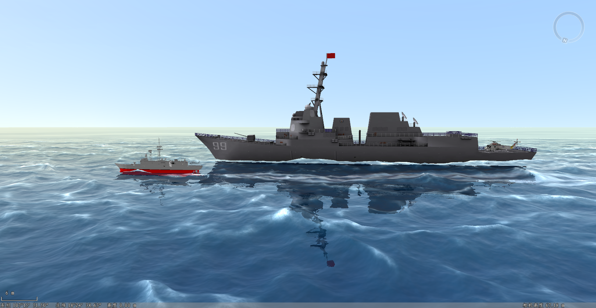

### 使用说明

通过设置相关参数，提供动态波浪、实时反射以及轮船尾迹等特效模拟真实海洋场景，提升浏览和显示效果。海面状况（海况）与海洋渔业生产、海洋开发和国防建设关系密切，对舰船平安航行、飞机巡逻侦查和舰载武器的使用有很大的影响，因此很有必要直观真实的展示海洋场景。

### 操作步骤

  1. 在工作空间管理器中，打开需要设置海洋特效的场景窗口。
  2. 在“ **场景** ”选项卡上“ **属性** ”组中，单击“ **场景特效** ”按钮，弹出“场景特效”面板，选择海洋特效。
  3. 开启海洋：勾选“开启海洋”后，才能显示海洋特效。
  4. **参数设置** ：
      * 开启反射：勾选此选项，开启海面反射模拟。
      * 浪花：勾选此选项，开启浪花模拟。
      * 风速：可直接键入数值作为风速，单位为米/秒。
      * 风向：设置海风的风向，这里的风向是指与正北方向的顺时针夹角，单位为度。
      * 海平面高度：设置海平面高度，单位为米。
      * 渲染质量：提供低级、中级和高级三种渲染质量模式。
      5. **动画设置** ：主要对水面扰动、冲击、尾迹等特效进行设置。
      * 工具栏提供添加、设置动态对象以及删除按钮。添加用于绘制添加扰动、冲击或尾迹特效。设置 动态对象是用于对某一KML对象添加扰动、冲击或者尾迹特效。删除是删除指定特效。
      * **扰动** ：用于模拟扰动特效。参数设置如下：
        * 冲击范围直径：设置冲击的范围直径，单位为米。
        * 扰动点：支持设置扰动点，只有通过添加的方式才会有扰动点参数。
        * 动态对象：选择设置动态对象的方式添加扰动特效时，显示KML模型要素名称。
      * **冲击** ：用于模拟冲击特效。
        * 速度:设置冲击速度，单位为m/s。
        * 冲击范围直径：设置冲击波的范围直径，单位为m。
        * 冲击物体质量：设置冲击物体的质量，单位为kg。
        * 冲击点：支持设置冲击点，只有通过添加的方式才会有冲击点参数。
        * 动态对象：选择设置动态对象的方式添加冲击特效时，显示KML模型要素名称。
      * **尾迹** ：为对应的轮船等模型添加尾迹。
        * 长度：设置尾迹的长度，单位为m。
        * 宽度：设置尾迹的宽度，单位为m。
        * 动态对象：选择设置动态对象的方式添加尾迹特效时，显示KML模型要素名称。
  6. 设置完成后，场景窗口实时显示海洋场景，下图为海洋特效示例。
 

