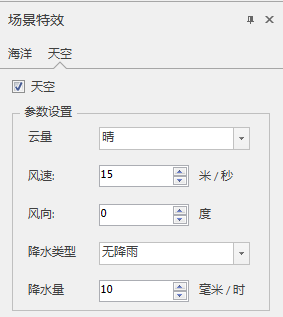
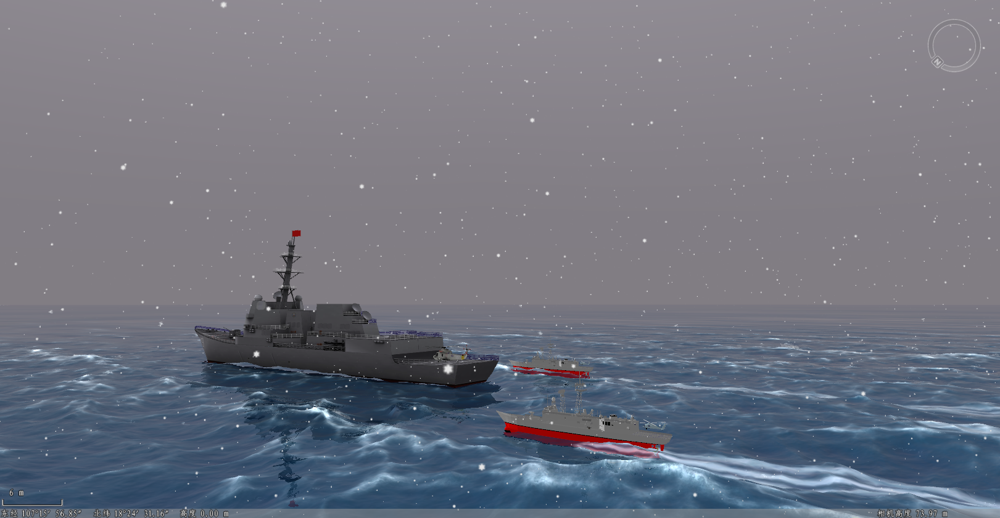

### 使用说明

通过设置相关参数，模拟真实天空场景，提升浏览和显示效果。该功能不仅提供各种参数设置，并且支持实时体积云、流云、镜头光晕和日夜交替，以达到不断变化的逼真效果。

### 操作步骤

  1. 在工作空间管理器中，打开需要设置天空特效的场景窗口。
  2. 在“ **场景** ”选项卡上“ **属性** ”组中，单击“ **场景特效** ”按钮，弹出“场景特效”面板，选择天空特效，下图为天空特效面板：  
  
 

  3. 开启天空：勾选“天空”后，才能显示天空特效。
  4. **参数设置** ：
      * 云量：提供晴、局部多云、多云、阴天四种模式。
      * 风速：可直接键入数值作为风速，单位为米/秒。
      * 风向：设置风向，这里的风向是指与正北方向的顺时针夹角，单位为度。
      * 降水类型：提供无降雨、雨、干雪、湿雪、雨夹冰雹五种类型。
      * 降水量：可直接键入数值作为降水量，单位为毫米/时。
  5. 设置完成后，场景窗口实时显示天空场景，下图为天空特效示例(阴天加雪)。
  

