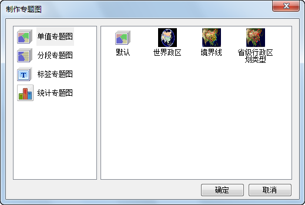

**使用说明**

“制作专题图”命令，用来对该矢量图层制作专题图，包括单值专题图、分段专题图和标签专题图。

**操作步骤**

  1. 右键单击图层管理器中的矢量图层结点，在弹出右键菜单中单击选择“制作专题图”命令；
  2. 单击后，弹出“专题图向导”对话框，如下图所示：  
  
 
  3. 在对话框中选择所要制作的专题图类型，单击“确定”按钮弹出该类型的专题图窗口，显示了专题图的设置信息，用户可以通过相应的设置得到需要的专题图。 

**相关主题**

[“专题图”选项卡](ThematicMap3DTab)

 

