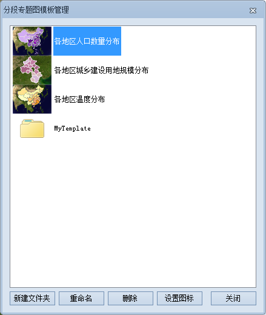

**使用说明**

模板管理器用来对系统预设的专题图模板和用户自定义的模板进行统一管理，方便专题图模板的重复使用。

**操作步骤**

  1. 在图层管理器中选中一个矢量图层，以激活“专题图”选项卡中相应的“模板”下拉按钮。
  2. 单击“模板”下拉按钮，在下拉菜单中单击“模板管理”按钮，弹出“分段专题图模板管理”对话框，如下图所示。  
    
  3. 在该对话框中，可通过相关的操作，对专题图模板以及保存模板文件的文件夹进行统一管理。 
       * 列表框区域：列举了系统提供的分段专题图模板以及用户自定义的分段专题图模板。
       * 新建文件夹：创建新的文件夹，用来保存管理器中的模板。新建文件夹的位置为："安装目录\Templates\Theme3D\Ranges\"，例如 Ranges 文件夹下的 MyTemplate 文件夹。可以通过拖曳的方式，将模板文件加入或者移出某一个文件夹。
       * 重命名：对模板文件或者文件夹进行重命名。
       * 删除：删除当前管理器中的模板文件或者文件夹。
       * 设置图标：模版文件默认的图标为相应全幅地图的缩略图。此功能可以将模板文件的图标指定的用户自定义的图片。
       * 关闭：关闭专题图模板管理器，退出当前窗口。

**备注**

除了应用“模板管理”功能对模板进行管理外，用户也可以直接打开"安装目录\Templates\Theme3D\Ranges "文件夹，管理相应的模板文件。

 

