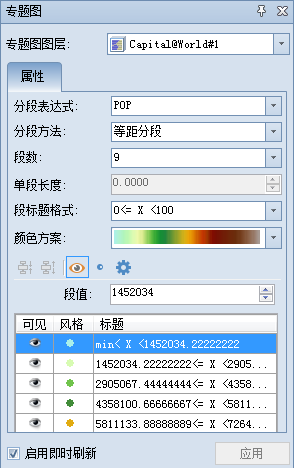
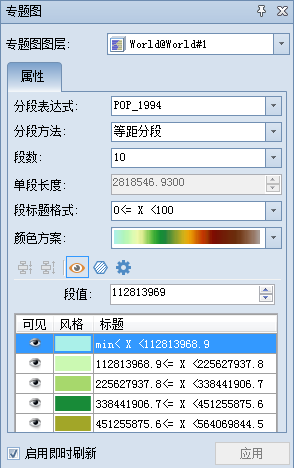
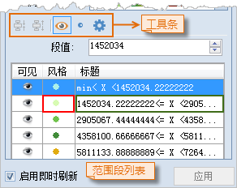
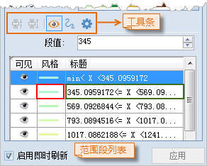
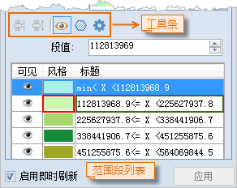

**使用说明**

用户可以在“三维分段专题图”窗口中编辑分段专题图的风格，以下我们来介绍如何修改三维分段专题图。

**操作步骤**

  1. **选择专题图图层：** “三维分段专题图”窗口中的“专题图图层”下拉框中选择当前要编辑的专题图图层。  
    

  2. **设置分段表达式：** 在“分段表达式”选框里设定当前分段专题图的专题变量，同时可以在下拉选框中的[ 表达式](../../Query/SQLDia  )里自定义专题变量。
  3. **选择分段方法：** 显示和设置当前三维分段专题图在对专题变量所确定的所有专题值进行分段时的分段方法。通过右侧的组合框的下拉列表选择合适的分段方法。
       * **等距分段：** 根据专题变量所确定的所有专题值中的最大值和最小值，按照用户设定的“段数”进行相等间距的分段。在等距离分段中，每一段具有相等的长度。
       * **平方根分段：** 对专题变量所确定的专题值的平方根为分段数据进行等距离分段。首先取所有专题值的平方根，然后进行等距离分段，得到处理后数据的分段点，然后将这些分段点的值进行平方得到对应专题值的分段点，从而得到专题值的分段方案。
       * **标准差分段：** 反映各对象的某属性值对其平均值的偏离。首先计算出专题变量所确定的专题值的平均值和标准偏差，在此基础上进行分段。标准差分段的每个分段长度都是一个标准差，最中间的那一段以平均值为中心，左边分段点和右边分段点分别与平均值相差0.5个标准差。标准差分段方法所得的“段数”由计算结果决定，用户不可控制。
       * **对数分段：** 与平方根分段方法基本相同，所不同的是平方根方法是对专题值取平方根，而对数分段方法是对专题值取对数，即对专题值的以10为底的对数值进行等距离分段。首先对所有专题值的对数进 行等距离分段，得到处理后数据的分段点，然后以10为底，这些分段点的值作为指数的幂，得到对应的专题值的各分段点的值，从而得到分段方案。
       * **等计数分段：** 每个范围段中具有相等数目的对象个数，“相等的个数”是由用户指定的“段数”以及用来制作分段专题图图层中实际的对象个数来决定的，在可以均分的情况下，每段中对象数目应该是一样的，但是当对象数目不可均分时，分段结果在最后一段内会有出入。
       * **自定义分段：** 由用户指定各段的长度，即“单段长度”进行分段，“段数”由应用系统根据指定的间隔距离以及专题值的最大和最小值来计算，用户不可控制。
  4. **调整段数：** 显示和设置当前三维分段专题图对专题值进行分段的分段数，即最终得到的范围段的个数。
  5. **单段长度：** 显示和设置当前三维分段专题图分段的间隔距离，即每个范围段的长度，该项的设置只有在分段方法为自定义分段时才有效。
  6. **段标题格式：** 指定表达每个范围段的值域范围的格式，主要提供两个格式，通过右侧的组合框进行选择设置。
  7. **设置颜色方案：** 在”颜色方案“选框中选择渐变色带，从而改变当前三维单值专题图的整体颜色风格。也可以通过下拉选框中的[ 自定义](../../Visualization/LayerStyle/AddColorRamp)选项定制自己喜欢的色带风格。  
    

  8. **合并或拆分范围段：** 选项卡下部的列表中列出了所有范围段，可根据需要对各范围段进行合并和拆分。 
       *  按钮用来将选中的多个连续的范围段（可配合使用 Ctrl 或 Shift 键）合并为一个范围段，合并后的范围段的值域范围为被合并的所有范围段的值域的并集。如果没有或者只有一个范围段被选中，或者选中的多个范围段不连续，则该按钮都不可用。
       *  按钮用来将选中的某一个范围段拆分为两个新的范围段。
  9. **设置专题图子项是否可见：** 参照动态界面，选中单个或多个专题图子项后可以单击   图标按钮设置选中的专题图子项是否可见。也可以通过单击专题图子项前的状态图标调整其可见性。
  10.  **设置专题图子项显示风格：** 参照动态界面，选中单个或多个专题图子项后可以单击“风格”按钮进行风格设置，点图层专题图可通过单击  按钮激活[点风格编辑器](Symbol3Dgroup  )，线图层专题图通过单击  按钮激活[线型符号选择器](Line3Dgroup  )，面图层专题图通过单击  按钮激活[填充符号选择器](Fill3Dgroup  )。
         * 多选专题图子项可以按下 **Ctrl** 键然后依次点选专题图子项，或按下 Shift 键单击专题图子项列表中预选的头项和尾向，可以选中头尾之间所有专题图子项。
         * 选好多个专题图子项后单击工具条中“风格”设置按钮，弹出“修改专题图子项风格”对话框，可在此选择要修改的项，进行批量修改。具体操作请参见：[修改专题图项风格](Thematic3DSymbolStyle  )。
  11.  **设置专题图子项扩展属性：** 选中要进行扩展属性设置的单个或多个专题图子项，单击  图标按钮，弹出“专题图子项扩展属性设置”窗口，可以进行三维专题图的扩展属性和贴图的设置。具体内容请参见[专题图子项扩展属性设置](Thematic3DTexture  )。
  12.  **调整段值：** “工具栏”下的“段值”数字显示框显示了每个范围段分段点（该段的终止点）的数值（如上图所示），每个数字显示框对应一个分段点，分段点的数值可以通过该数字显示框进行改变，改变后的结果会实时反映到当前分段专题图图层上。
  13.  **设置专题图子项的标题内容：** 专题图子项的标题内容可以修改，选中要编辑的专题图子项的标题内容后单击标题内容文本框变成可编辑状态。
  14.  **即时刷新设置：** 默认情况下“启用即时刷新”设置时开启的，用户对专题图图层的每一步风格设置都会即时的显示在场景中 。用户也可以取消“启用即时刷新”勾选框不 启用实时刷新，通过单击“应用”按钮，将用户定制的参数设置应用于当前专题图。

**备注**

用户通过制作和修改的三维专题图都可以保存为模板，以便应用到其他三维图层的专题图制作中，保存专题图模板具体操作请参见：[保存到专题图模板](Theme_SaveThemeTempl  )。

**相关主题**

 [新建三维分段专题图](RangesMap3DDefault)  
 [基于模板制作三维分段专题图](RangesMap3DTemplate)  
 [保存到专题图模板库](Theme_SaveThemeTempl)

 

