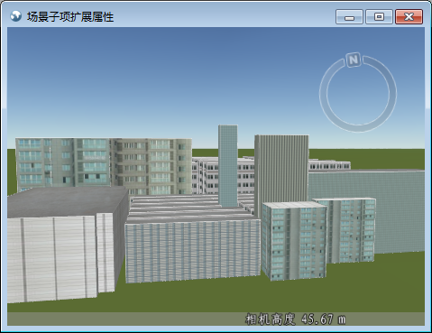
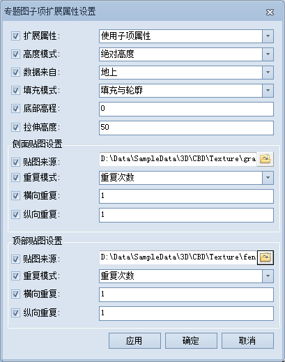

**使用说明**

专题图子项扩展属性设置功能用来对专题图子项的扩展属性以及纹理贴图等属性进行设置。通过对各个专题图子项设置不同的扩展属性，可以各个模型对象得到不同的显示效果。显示效果如下图所示：  
  
  
目前支持对三维单值专题图和三维分段专题图进行扩展属性的设置。

**操作步骤**

  1. 在三维专题图窗口中，选中要进行属性设置的单个或多个专题图子项，单击“子项扩展属性设置”按钮 ，进入“专题图子项扩展属性设置”窗口。  
   
  
  2. 设置扩展属性使用的类型，与专题图图层一致或者使用子项属性。默认专题图子项扩展属性与专题图图层一致。只有设置为使用子项属性时，其它属性设置才有效。 
       * **与图层属性一致** ：表示专题图子项的扩展属性与专题图图层的扩展属性保持一致，即与功能区（Ribbion）中的“ **图层属性** ”选项卡的“ **扩展属性** ”组中的属性一致。
       * **使用子项属性** ：专题图窗口中选中的子项将使用“专题图子项扩展属性设置”窗口中设置的属性，而其它子项使用专题图图层的扩展属性。
  3. 修改高度模式为非贴地模式，即根据实际需求将高度模式改为绝对高度、相对地面模式。有关高度模式的介绍，请参见[关于高度模式](../AdvancedLayserSetting/AboutAltitudeMode)。
  4. 设置数据类型，地上或者地下。注意：只有当高度模式为非贴地时，该属性可用。
  5. 设置子项的填充模式，提供了填充、轮廓和填充与轮廓三种方式，用于设置选中子项的贴图填充模式。
  6. 设置当前子项的底部高程值和拉伸高度。有关底部高程和拉伸高度的介绍，请参见[设置底部高程和拉伸高度](../AdvancedLayserSetting/SettingHeight  )。
  7. 对当前子项的侧面（顶面）贴图进行设置，包括侧面（顶面）贴图的重复模式，贴图所在的路径，以及横向重复次数（横向大小）和纵向重复次数（纵向大小）。 
       * 贴图来源：贴图图片所在的位置。需要选择图片的所在的绝对路径。
       * 重复模式：提供了2种重复模式，重复次数和实际大小。 
          * 重复次数 ：即贴图重复放置的次数，分为横向重复次数和纵向重复次数。
          * 实际大小 ：指使用贴图的实际大小进行贴图，分为横向大小和纵向大小。
       * 横向（纵向）重复：贴图在横向（纵向）重复的次数。可以输入正整数指定图片横向重复次数。
       * 横向（纵向）大小：贴图在横向（纵向）的实际大小，默认单位为米。可输入实际使用的数值设置图片横向（纵向）大小。
  8. 完成设置后，单击“应用”按钮，查看设置效果，或者单击"确定"按钮退出当前设置窗口。

**备注**

  * 可以同时选中多个专题图子项，对其扩展属性统一进行设置。设置完成后，如需要对其中某一项参数需要修改，只需选中该参数前的复选框，直接修改即可。其他未修改的内容保留原来的设置。
  * 为了更加突出贴图的真实效果，建议修改专题图子项风格的前景色，达到更佳的显示效果。

**相关主题**

[设置对象表面贴图](../AdvancedLayserSetting/SettingTexture)

 

