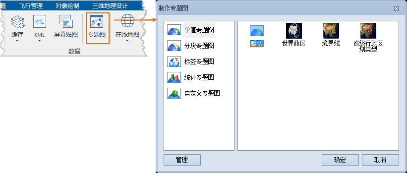

SuperMap 通过制作专题图，实现不同数据的专题表达效果。“ **场景** ”选项卡“ **数据** ”组中“ **专题图**”功能组织了为三维图层制作三维专题图的功能。SuperMap 支持对添加到场景中的矢量数据集（包括点、线、面数据集，网络数据集，路由数据集，CAD模型数据集）的三维图层，即矢量数据集类型的三维图层制作三维专题图。

“ **场景** ”选项卡是上下文选项卡，与场景窗口进行绑定，只有应用程序中当前活动的窗口为场景窗口时，该选项卡才会出现在功能区上。

  

  
可以在场景中制作以下几种专题图：  
 [三维单值专题图](UniqueMap3Dgroup)  
 [三维分段专题图](RangesMap3Dgroup)  
 [三维标签专题图](LabelMap3Dgroup)  
 [三维统计专题图](GraphMap3Dgroup)  
 [三维自定义专题图](CustomizeMap3Dgroup)  
