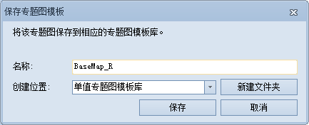
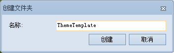

**使用说明**

“保存到专题图模板库”命令，用来将该三维专题图输出为专题图模板并保存到专题图模板库中。

专题图模板实质是一个记录了专题图信息的 *.xml 文件。

**操作步骤**

  1. 右键单击选中图层管理器中的某个三维专题图图层结点，在弹出右键菜单中选择“专题图模板”中的“保存到库…”选项；
  2. 弹出“保存专题图模板”对话框，输入专题图模板的名称，单击“创建位置”后的下拉框选择模板库中已有的文件夹为存放位置，单击对话框中的“添加”按钮；
  3. 也可以单击“新建文件夹”按钮，创建新的文件夹保存专题图模板。单击“添加”按钮，将自动保存模板并关闭当前对话框，即可完成专题图模板库的保存工作。下图以保存单值专题图模板到模板库为例：  
  

  4. 也可以单击“新建文件夹”按钮，创建新的文件夹保存专题图模板。单击“保存”按钮，关闭当前对话框自动，即可完成专题图模板库的保存工作。新建的模板库存放位置为："安装目录\Templates\Theme3D\"下的相应专题图类型的子文件夹中。  
  

  5. 保存成功后，单击“专题图”选项卡相应的专题图组的“模板”下拉按钮，可以查看或者应用保存的专题图模板。

**注意事项**

  1. 应用程序提供了专题图模板库，放置了丰富的专题图制作模板；同时，用户可以将自己制作的专题图作为模板保存到专题图模板库中。
  2. 模板库存放在"安装目录\Templates\Theme3D\"下的相应专题图类型的子文件夹中。子文件夹名称与功能区上“三维专题图”选项卡中的“单值”组、“分段”组、“标签”组和“统计”组相对应，不同类型专题图的“模板”下拉按钮将从对应的子文件里获取模板信息。

 

