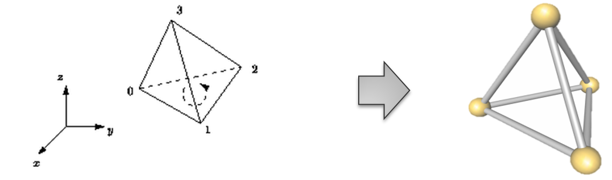
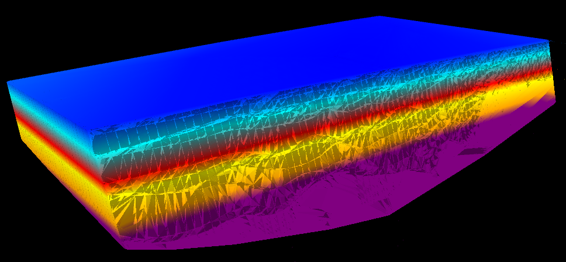

**使用说明**  
　　TIM（不规则四面体网格）是针对连续三维空间的不规则划分，其最小单元为不规则四面体。TIM通过拓扑连接、高精度的N个不规则四面体构成。  
  
  
该功能通过三维点数据集插值构建成TIM模型。

**操作步骤**
1. 在“工作空间管理器”处打开存有三维点的数据源，在“ **三维数据** ”选项卡的“ **三维场数据** ”组中，单击“构建TIM”按钮，弹出“构建TIM”对话框。  
2. **源数据** ：设置将用于生成TIM的三维点数据集。   
    * **数据源** ：单击右侧下拉框按钮，选中三维点数据集所在的数据源；
    * **数据集** ：右侧滑动框内列出了所选数据源下的所有三维点数据集。
    * **特征值** ：构建时按照特征值进行插值。
3. **结果数据** ：设置用于保存TIM模型的数据源与数据集。 
    * **数据源** ：单击右侧下拉框按钮，选择用于保存TIM模型的数据源；
    * **数据集** ：输入TIM模型数据集的名称。   
“构建”操作结果则是在目标数据源下生成了一个TIM模型，该数据集可用于基于特征值的[分层设色](../../LayersManagement/Layer3DProperty_Model)

  
 
**注意事项**  
  * 当数据源内含有三维点数据集时，“构建TIM”按钮才能够点击，否则“构建TIM”功能不可触发。

 

