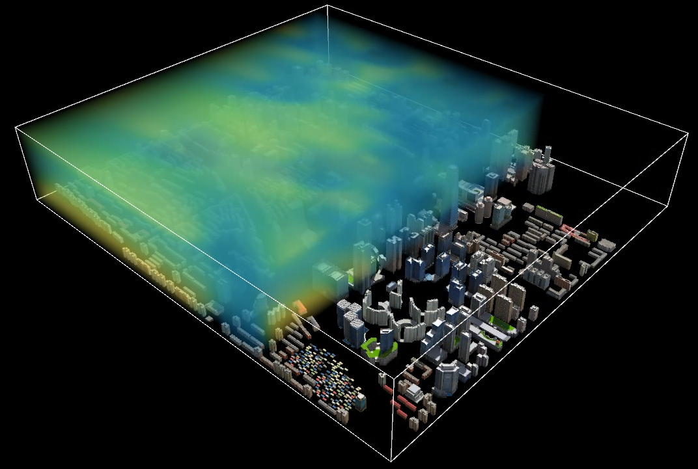

　　体元栅格体数据属于光栅数据，光栅数据采用网格形式组织并使用二维栅格的像素值来记录数据，每个栅格（cell）代表一个像素要素，栅格值可以描述各种数据信息。体元栅格体数据集中每一个栅格存储的是三维体数据以切片采样方式的值。
“ **三维数据** ”选项卡“ **三维场数据**
”组下，包含了一些与体元栅格有关的功能。主要有二维栅格构建体元栅格、三维点构建体元栅格、体元栅格生成缓存以及体元栅格提取属性的功能。  
  
  
**内容提要：**  
 [构建体元栅格](VoxelGrid_Build)  
 [体元栅格生成缓存](VoxelGrid_GenerateCache)  
 [体元栅格提取属性](VoxelGrid_ExtractProperty)  
[体元栅格图层属性](../../LayersManagement/Layer3DProperty_VoxelGrid)

**构建说明：**  
 [三维点插值方式](VoxelGrid_BuildByPoint3D)  
 [TIM插值方式](VoxelGrid_BuildByTIM)  
 [二维栅格构建方式](VoxelGrid_BuildByGrid)

 

