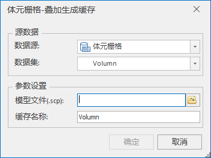

### 使用说明

多个体元栅格支持叠加到同一份模型缓存，支持设置不同的体渲染效果，表达不同的属性场。

### 操作步骤

  1. 在“ **三维数据** ”选项卡“ **三维瓦片缓存** ”组内的“ **生成缓存** ”下拉菜单中，单击“ **体元栅格叠加生成缓存**”按钮，弹出“体元栅格-叠加生成缓存”，如下图所示：
  

  2. 源数据：
      * 数据源： 选择生成缓存的体元栅格所在的数据源。
      * 数据集： 选择生成缓存的体元栅格所在的栅格数据集。
  3. 参数设置：
      * 模型文件：选择与体元栅格叠加的模型缓存文件。 
      * 缓存名称：自定义结果缓存名称。
  
  4. 设置完以上参数后，单击“确定”按钮，即可执行体元栅格叠加模型生成缓存的操作。

### 注意事项

  1. 多个体元栅格支持叠加到同一份模型缓存，可重复以上操作步骤，数据集选择不同的体元栅格数据，设置不同的体渲染效果，表达不同的属性场。详情见分层设色表达/颜色表中的[体数据](../../AdvancedLayserSetting/Layer3DProperty_HypsometricSetting)。
  2. 体元栅格必须有[影像金字塔](../../../DataProcessing/DataManagement/PyromidManagement)才可以生成缓存。

