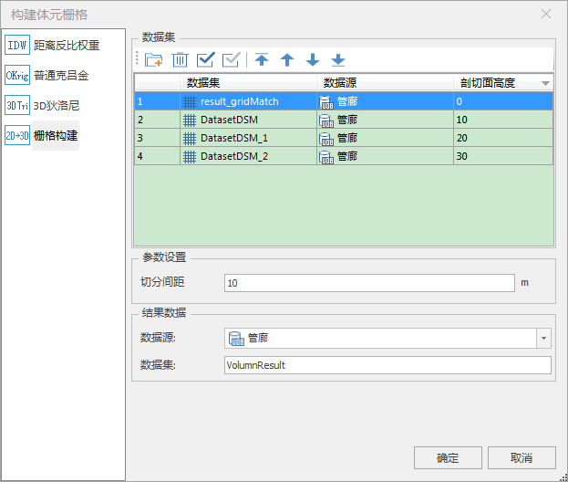

### 使用说明

体元栅格体数据属于光栅数据，光栅数据采用网格形式组织并使用二维栅格的像素值来记录数据，每个栅格（cell）代表一个像素要素，栅格值可以描述各种数据信息。体元栅格体数据集中每一个栅格存储的是三维体数据以切片采样方式的值。

二维栅格构建体元栅格是多个二维栅格通过指定顺序追加构建的方式构建成体元栅格。

### 操作步骤

  1. 在“工作空间管理器”处打开存有栅格数据集的数据源，在“ **三维数据** ”选项卡的“ **三维场数据** ”组中，单击“ **构建体元栅格** ”按钮，弹出“构建体元栅格”对话框，选择“栅格插值”方式，如下图所示：
  
 
  2. 鼠标单击**添加**按钮，选择构建体元栅格的源数据集。
  3. 源数据集：设置源数据源、源数据集以及剖切面高度。
     * 剖切面高度：设置每层剖切面的高度。 
  4. **参数设置** ：设置栅格体数据在空间中显示的高度范围。 
      * **最小高度** ：设置显示该体元栅格体数据的最小高度值，单位为米。
      * **最大高度** ：设置显示该体元栅格体数据的最大高度值，单位为米。 
  5. **结果数据** ：设置用于保存体元栅格体数据集的数据源与数据集。 
      * **数据源** ：单击右侧下拉框按钮，选择用于保存栅格数据集的数据源；
      * **数据集** ：输入体元栅格体数据集的名称，默认名称为VolumnResult。 
  6. 设置完以上参数后，单击“确定”按钮，即可执行构建体元栅格体数据集的操作。

### 注意事项

  1. 当数据源内含有栅格数据集时，“三维数据”组中的“构建体元栅格”按钮才能够点击，否则“构建体元栅格”功能不可触发。

