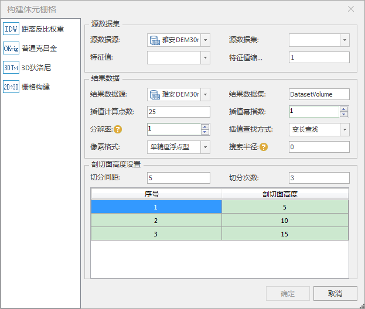

### 使用说明

体元栅格体数据属于光栅数据，光栅数据采用网格形式组织并使用二维栅格的像素值来记录数据，每个栅格（cell）代表一个像素要素，栅格值可以描述各种数据信息。体元栅格体数据集中每一个栅格存储的是三维体数据以切片采样方式的值。

三维点插值构建体元栅格可以分成 **距离反比权重** 和 **普通克吕金**
两种方式，详细可以参考[关于插值](../../../Analyst/Raster/interpolation/aboutinterpolation)。

### 操作步骤

  1. 在“工作空间管理器”处打开存有三维点数据集的数据源。在“ **三维数据** ”选项卡的“ **三维场数据** ”组中，单击“ **构建体元栅格** ”按钮，在弹出“构建体元栅格”对话框中选择“ **距离反比权重** ”或者“ **普通克吕金** ”方式，如下图所示，其设置参数一致。
  

  2. **源数据集** ：设置待构建的三维点数据集以及其特征值字段和缩放。 
      * **特征值** ：设置显示该体元栅格体数据的最小高度值，单位为米。
      * **特征值缩放** ：设置显示该体元栅格体数据的最大高度值，单位为米。 
  3. **结果数据** ：设置输出体元栅格体数据集的参数。 
      * **数据源** ：单击右侧下拉框按钮，选择用于保存栅格数据集的数据源；
      * **数据集** ：输入体元栅格体数据集的名称，默认名称为DatasetVolume。 
      * **插值计算点数** ：设置期望参与插值运算的点数。当查找方式为定长查找时，表示期望参与运算的最少样点数；当查找方式为变长查找时，表示期望参与运算的最多样点数。 
      * **插值幂指数** ： 设置距离权重计算的幂次,默认值为1.
      * **分辨率** ：设置三维插值运算所获得的栅格数据的分辨率。该值不能超过待分析数据集的 Bounds 范围的边长。默认值为1。 
      * **插值查找方式** ： 设置在插值运算时，查找参与运算点的方式。该方式包括三种方式如下： 
        * **不进行查找** ： 使用所有的输入点进行内插分析。 
        * **定长查找** ： 指定半径范围内所有的采样点都参与栅格单元的插值运算。 
        * **变长查找** ： 距离栅格单元最近的指定数目的采样点参与查找运算。 
      * **像素格式** ： 设置栅格与影像数据存储的像素格式类型。默认为单精度浮点型。
      * **搜索半径** ： 设置查找参与运算点的查找半径。查找半径决定了参与运算点的查找范围，当计算某个位置的未知数值时， 会以该位置为圆心，以该属性设置的值为半径，落在这个范围内的采样点都将参与运算， 即该位置的预测值由该范围内采样点的数值决定。 默认为0。
  4. **剖切面高度设置** ：设置数据集各剖切面高度。
      * **切分次数** ：设置剖切面的切分层数。
      * **剖切面高度** ：设置每层剖切面的高度。 
  5. 设置完以上参数后，单击“确定”按钮，即可执行构建体元栅格体数据集的操作。

### 注意事项

1.  当数据源内含有三维点数据集时，“体元栅格”组中的“三维点构建体元栅格”按钮才能够点击，否则“三维点构建体元栅格”功能不可触发。

