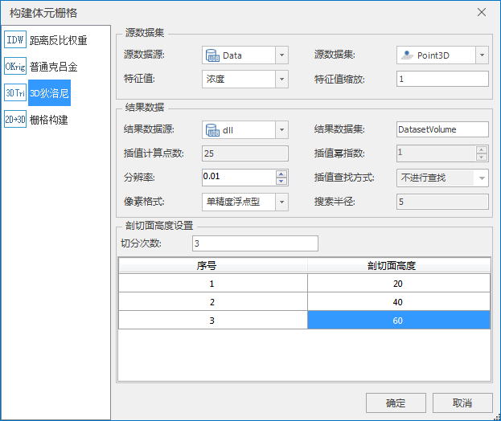

**使用说明**
体元栅格体数据属于光栅数据，光栅数据采用网格形式组织并使用二维栅格的像素值来记录数据，每个栅格（cell）代表一个像素要素，栅格值可以描述各种数据信息。体元栅格体数据集中每一个栅格存储的是三维体数据以切片采样方式的值。

TIM插值构建体元栅格是三维点数据集通过“ **3D狄洛尼** 插值方式构建成TIM，TIM再通过“IDW”方式插值构建成体元栅格”。

**操作步骤**

  1. 在“工作空间管理器”处打开存有三维点数据集的数据源， 在“ **三维数据** ”选项卡的“ **三维场数据** ”组中， 单击“ **构建体元栅格** ”按钮，在弹出的“构建体元栅格”对话框中 选择“ **3D狄洛尼** ”方式。如下图所示，和三维点插值构建方式相比，部分参数不可用。  
    
  2. **源数据集** ：设置待构建的三维点数据集以及其特征值字段和缩放。 
       * **特征值** ：设置显示该体元栅格体数据的最小高度值，单位为米。
       * **特征值缩放** ：设置显示该体元栅格体数据的最大高度值，单位为米。 
  3. **结果数据** ：设置输出体元栅格体数据集的参数。 
       * **数据源** ：单击右侧下拉框按钮，选择用于保存栅格数据集的数据源；
       * **数据集** ：输入体元栅格体数据集的名称，默认名称为DatasetVolume。 
       * **分辨率** ：设置三维插值运算所获得的栅格数据的分辨率。该值不能超过待分析数据集的 Bounds 范围的边长。 
       * **像素格式** ： 设置栅格与影像数据存储的像素格式类型。
  4. **剖切面高度设置** ：设置数据集各剖切面高度。 
       * **切分次数** ：设置剖切面的切分层数。
       * **剖切面高度** ：设置每层剖切面的高度。 
  5. 设置完以上参数后，单击“确定”按钮，即可执行构建体元栅格体数据集的操作。

**注意事项**

  * 当数据源内含有三维点数据集时，“体元栅格”组中的“三维点构建体元栅格”按钮才能够点击，否则“三维点构建体元栅格”功能不可触发。

 

