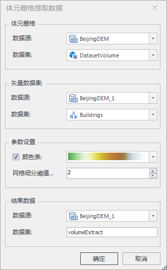

**使用说明**

　　体元栅格提取属性功能根据三维点、线、面及模型数据集，提取对应体元栅格属性。  
　　三维点会重新生成三维点数据集并将从体元栅格数据中提取的属性另存到新生成的三维点数据集中。三维线、面及模型通过设置网格细分阈值参数，会重新生成模型数据集并将提取的属性另存到新生成的模型数据集的W位。

**操作步骤**

  1. 在“ **三维数据** ”选项卡的“ **三维场数据** ”组中，单击“ **提取属性** ”，弹出“体元栅格提取数据”对话框，如下图所示。  
    
  2. 体元栅格，设置提取属性的体元栅格。 
       * **数据源** ：单击组合框下拉按钮，选择提取属性的体元栅格所在的数据源。
       * **数据集** ：单击组合框下拉按钮，选择提取属性的体元栅格所在的数据集。
  3. 矢量数据集，设置提取属性需要的矢量数据集。 
       * **数据源** ：单击组合框下拉按钮，选择提取属性需要的矢量数据集所在的数据源。
       * **数据集** ：单击组合框下拉按钮，选择提取属性需要的矢量数据集所在的数据集。
  4. **参数设置** ： 
       * **颜色表** :勾选“ **颜色表** ”复选框，设置颜色表。单击“ **颜色表** ”右侧按钮，在弹出的下拉菜单中选择颜色表，也可自定义。单击 **自定义** 按钮，弹出“颜色方案编辑器”对话框，根据需要自定义颜色方案。
       * **网格细分阈值...** :设置网格细分阈值，默认为2。
  5. **结果数据** ： 
       * **数据源** :单击组合框下拉按钮，选择提取属性结果存放所在的数据源。
       * **数据集** :输入字符串作为结果数据源名称。
  6. 设置完以上参数后，单击“确定”按钮，即可执行体元栅格提取属性的操作。

 

