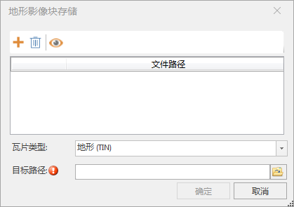

### 使用说明

为了进一步提升地形（TIN）、地形（DEM）、影像的加载浏览效率，提供了“地形影像块存储”功能。

### 操作步骤

  1. 在“ **三维数据** ”选项卡的“ **三维瓦片** ”组中的“ **缓存工具** ”下拉按钮中，单击“ **地形影像块存储** ”按钮，弹出“地形影像块存储”对话框。
  

  2. 文件列表：显示添加的配置文件。包含添加配置文件按钮，用于添加配置文件；删除按钮，用于删除列表中的文件；显示文件全路径按钮，用于设置是否显示配置文件的绝对路径。
  3. 瓦片类型：单击右侧按钮，选择加载的瓦片类型，支持地形(TIN)、地形(DEM)和影像三种。选择地形(TIN)和地形(DEM)添加的是分别对应的*.sct配置文件。选择影像添加的*.sci3d配置文件。
  4. 目标路径：单击右侧按钮，在弹出的“浏览文件夹”对话框中设置大文件数据保存的路径，单击“确定”按钮；也可在文本框中直接输入文件夹路径。
  5. 设置完以上参数后，单击“确定”按钮，即可执行地形影像块存储操作。

