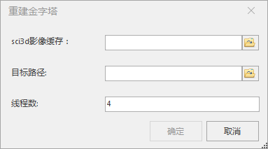

### 使用说明

“影像缓存重建金字塔”功能，支持影像缓存重建影像金字塔，此功能主要是针对早期版本生成的缓存层级切换出现错位的情况。

### 操作步骤

  1. 在“ **三维数据** ”选项卡的“ **三维瓦片** ”组中，单击“ **缓存工具** ”下拉菜单中的“ **影像缓存重建金字塔** ”按钮，弹出“重建金字塔”对话框。  
  
  
  2. **sci3d影像缓存** ：选择用于重建金字塔的影像缓存数据。
  3. **目标路径** ：设置用于保存结果数据的路径。
  4. **线程数** ：设置参与创建金字塔的线程数，使创建影像金字塔更加高效。

