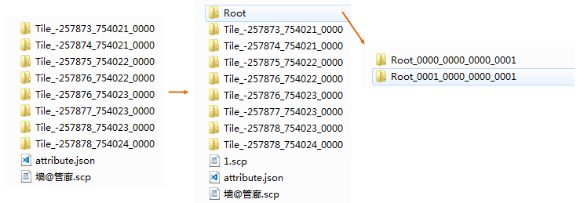

**使用说明** 

　　“合并根节点”功能适用于精模缓存，且缓存文件类型仅支持S3M和S3MB，是将相邻一定空间范围的根节点合并为一个根节点，即向上抽稀生成了一层更为粗糙的LOD层级，每合并一次，模型根节点数量减少约为原始数量的1/2。

**操作步骤**

1. 单击“ **三维数据** ”选项卡中“ **模型** ”组中" **合并根节点** "按钮，弹出“合并根节点”对话框。
2. 源模型文件（.scp)：选择进行合并根节点操作的模型缓存文件。
3. 目标文件名：生成结果数据的scp文件的名称。
4. 线程数：分配给合并根节点操作的线程数，默认为4个线程参与操作，用户可自定义线程数。 
5. 金字塔层级数：用于设置根节点合并次数。如输入1，即模型根节点将进行一次合并处理。
6. 网格简化率：表示模型显示的细节按照百分比进行简化。简化网格有利于合理地分配模型渲染的资源，达到高效率的场景显示。  
　　本案例的数据经合并处理后，8个根节点被合并，生成了2个新的根节点，则在目标文件夹下新生成了一个scp配置文件(1.scp)及一个根节点文件夹(Root)，内含2个根节点文件，
SCP配置文件记录了合并后模型对应的根节点名称。

  
 

  
 

