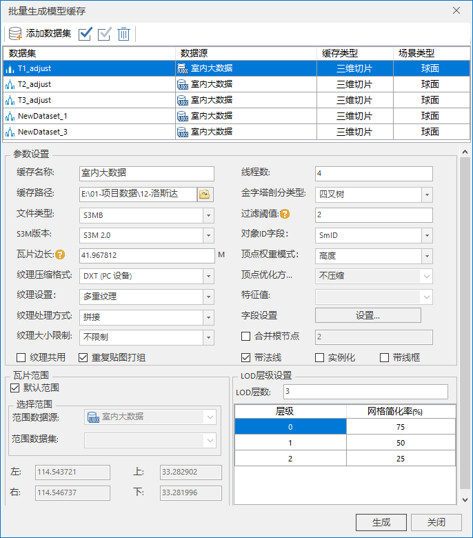

**使用说明**

　　一次性将数据源中的模型数据（模型数据集或CAD）生成一份OSGB或S3M或S3MB格式缓存文件，加载此模型缓存，能够大幅度提升模型浏览性能与显示效果。

**操作步骤**

  1. 在工作空间管理器中，打开需要生成模型缓存的数据源。
  2. 在“ **三维数据** ”选项卡上“ **三维瓦片缓存** ”组中，单击“ **生成缓存** ”下拉菜单中的 **批量生成缓存** 内的**模型** 按钮，弹出“批量生成模型缓存”对话框。  
  
 
  3. 添加数据集时,单击按钮，在打开的“选择”界面选择数据集。
  4. "选择"对话框界面左边区域内选择数据源，界面右边区域显示选中数据源内的所有模型数据集，单击“全选”或多选，确定添加的数据集，单击“确定”执行数据集添加操作，也可新建数据集作为添加数据集。  
  5. 单击“全选”按钮，将添加的模型数据集全部选中。
  6. 参数设置 
     * **缓存用途（纹理压缩格式）** ：设置生成的场景缓存的用途，主要用于普通 PC 设备和 iOS 系列设备、Android 系列设备等四种。对于不同用途的缓存，应用程序将采用不同的纹理压缩方式，以减少纹理图像所使用的显存数量。 
       * **普通PC设备** ：适用于 PC 机（个人计算机）上通用的压缩纹理格式。
       * **iOS系列设备** :适用于苹果 iOS 设备上通用的压缩纹理格式。以此种方式进行纹理压缩时，同时会生成一个离线地图包，方便 iOS 设备用户使用。
       * **Android 系列设备** :适用于 Android 设备上通用的压缩纹理格式。以此种方式进行纹理压缩时，同时会生成一个离线地图包，方便 Android 设备用户使用。
       * **不压缩** ：不对纹理进行压缩。
       * **缓存名称** ：生成缓存的配置文件名，默认与数据源名一致，可修改。
       * **缓存路径** ：模型缓存存储路径，在该路径下创建了一个以缓存名称命名的文件夹存放缓存文件。
     * **瓦片边长** ：显示和设置瓦片边长的大小，单位为米。瓦片边长大小不同则对应的比例尺不同，将鼠标移至“瓦片边长”标签后的问号处，即可查看瓦片边长与比例尺、层级的对应关系。“瓦片边长”标识了缓存层相对于指定瓦片边长所对应的比例尺。
     * **特征值** ：用于后期进行分层设色的属性字段，可不进行选择。
     * **对象字段ID** ：用于设置唯一标识ID的字段，通过下拉箭头进行选择。
     * **顶点优化方式** ：只有当顶点权重模式为无时，可以设置顶点优化方式。提供压缩顶点和不压缩两种方式。
     * **顶点权重模式** ：提供无、数据集字段和三角形最短边三种方式。其中，无是指以高度作为权重，数据集字段是指以指定字段作为权重，三角形最短边是指以点所在的三角形最短边作为权重。
     * **特征值** ：只有选择数据集字段作为顶点权重模式时，该选项可用。单击右端下拉箭头指定字段。
     * **过滤阈值** ：用于设置过滤粗糙层子对象的参数，默认为2，单位为像素。如若输入2，则表示小于2像素的子对象被过滤掉。
     * **金字塔剖分类型** ：设置缓存切片创建树型金字塔的剖分类型，应用程序提供了四叉树和八叉树两种方式。 默认使用四叉树剖分。
     * **文件类型** ：分为OSGB、S3M、S3MB三种文件缓存类型。
     * **线程数** :默认为4。
     * **纹理大小限制** ：用于设置纹理大小，可选不限制、1024像素*1024像素、2048像素*2048像素以及4096像素*4096像素等选项，默认为不限制。
     * **纹理处理方式：** 用于设置生成的缓存的纹理处理方式，提供了拼接、拼接且重映射和纹理重映射三种方式。其中，拼接适用于三角网较密集的数据，对于这类数据采取拼接的方式会提高生成缓存的效率。
     * **纹理共用、带法线、带线框、重复贴图打组、实例化5个选项：** 默认勾选带法线和重复贴图打组，根据需求可自行勾选。

  7. 瓦片范围：对“缓存范围”区域进行设置，有以下两种方式： 

       * 勾选“默认范围”复选框，默认采用数据集的范围，左上右下四个文本框显示了系统默认范围； 
       * 不勾选“默认范围”复选框，用户可自定义范围。有两种方式，一种是通过选择范围数据集，取选择的数据集的范围；另一种是直接在左上右下四个文本框中输入范围值。

8. LOD层级设置。用于设置缓存的LOD层级数，在数值框中直接设置即可。 

     * **网格简化率** ：指对应LOD层模型显示的细节按照百分比进行简化。有利于合理地分配模型渲染的资源，达到高效率的场景显示。

     * 设置完成后，单击“生成”按钮，执行模型缓存生成操作。其中 *.scp 为缓存配置文件，indexData.dat 为缓存索引文件。

**注意事项**

  1. 瓦片边长决定了缓存根节点数量：边长越大，根节点越少；相反，边长越小，根节点越多，生成缓存时间更长。根节点数量过多时，加载模型将在一定程度上变慢。
  2. LOD层级数对模型显示时的切换平滑效果有影响：LOD层级数越大，模型显示时切换的效果越平滑；另一方面，LOD层级数设置过大，将导致生成冗余层级的模型，生成缓存耗费时间较长。请根据显示需求设置合理数值。

 

