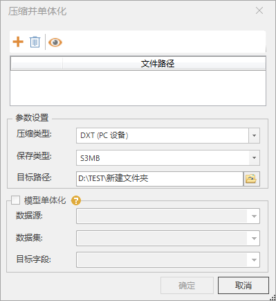
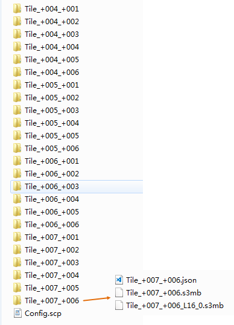

**使用说明**

　　“压缩并单体化”功能是对倾斜摄影模型数据进行纹理压缩和单体化，模型数据可以进行纹理压缩。支持生成S3M/S3MB格式的结果数据。S3M全称为 Spatial
3D Model。

**操作步骤**

  1. 在“ **三维数据** ”选项卡上的“ **三维瓦片** ”组中，单击“ **压缩并单体化** ”按钮，弹出“压缩并单体化”对话框。
  2. 单击“源SCP文件”右侧文件浏览按钮，在弹出的“打开”对话框中，选择 *.scp 文件，或者直接在文本框中输入 *.scp 文件的路径和名称。
  3. 设置数据的压缩类型，目前支持四种压缩类型：普通PC设备、iOS系列设备、Android系列设备和iOS系列设备-快速，默认为“普通PC设备”。对于不同用途的数据，采用不同的纹理压缩方式，以减少纹理图像所使用的显存数量。   
      **普通PC设备** ：适用于 PC 机（个人计算机）上通用的压缩纹理格式。  
      **iOS系列设备** ：适用于苹果 iOS 设备上通用的压缩纹理格式。  
      **Android 系列设备** ：适用于 Android 设备上通用的压缩纹理格式。  
      **iOS系列设备-快速** ：适用于苹果 iOS 设备上快速压缩的压缩纹理格式  
    
 
  4. 单击“保存类型”下拉按钮可选择类型，默认为S3MB。
  5. 单击“目标路径”右侧浏览按钮，在弹出的“浏览文件夹”对话框中选择结果数据的保存路径，或在文本框中直接输入结果数据的保存路径。
  6. 设置好以上参数后，单击“确定”按钮。生成的数据如下图所示：  
  

**注意事项**

  1. 只有在打开数据源的前提下，才能在生成S3M数据的同时进行模型单体化操作。

 

