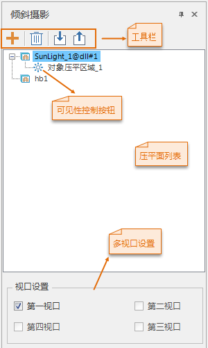
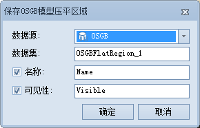
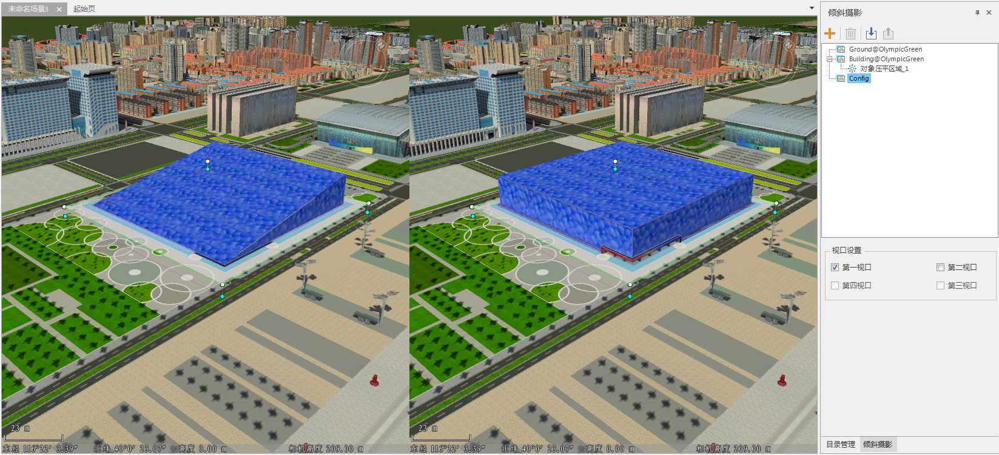

**使用说明**

　　模型压平功能可将场景中绘制区域内的模型压平，以便于周边的地物进行对比，更好的规划城市建设。该功能适用于 OSGB模型数据的索引文件，及通过“OsgbConfigFileGenerator”OSGB 索引文件生成工具生成的 *.scp 数据。

**操作步骤**

  1. 新建场景后，在“图层管理器”中，单击“普通图层”结点右键，选择“添加模型缓存图层…”项，将 OSGB 模型索引文件（*.scp）添加到当前场景中。
  2. 在“ **三维数据** ”选项卡的“ **倾斜摄影** 选择”组内的“ **倾斜操作** ”下拉按钮中，单击“ **模型压平** ”按钮，弹出“倾斜摄影”面板，如下图所示。  
    
  3. 在“倾斜摄影”面板中选中需进行压平操作的 OSGB 缓存图层，并添加该图层的压平面，缓存图层对应的压平面只对该图层生效。压平面的添加有绘制和导入两种方式： 
       * **绘制** ：在面板的工具栏中单击  按钮，将鼠标移至场景时变成  状态，即可绘制压平面。绘制的压平面数据为临时数据，保存在CAD数据集中。
       * **导入** ：单击面板工具栏的  按钮，在弹出的“导入OSGB模型压平区域”对话框中选择三维面数据集作为压平面，并设置压平面名称和可见性字段名称。 
  4. OSGB 面板工具栏处提供了添加、删除、导入和导出压平面的功能，具体说明为：   
工具条按钮说明  
       *  按钮：用来绘制压平面区域范围，操作方式与绘制面对象一致。
       *  按钮，用来移除对象压平面区域列表中选中的记录，删除压平面记录的同时会清除场景中 OSGB 模型的压平效果。
       *  按钮：用来导入三维面数据集作为压平面，“导入OSGB模型压平区域”对话框如下图所示：     
       
**数据源** ：要导入的压平面数据所在的数据源。  
**数据集** ：压平面数据所在的三维面数据集。  
**名称** ：指定导入压平面名称所在的字段，或在组合框中直接输入压平面名称，该名称显示在压平面记录列表中。  
**可见性** ：指定压平面在场景中是否可见的字段。

     *  按钮：将压平面导出为三维面数据集，可设置名称、可见性字段信息保存到属性表中。  
         
**数据源** ：要保存的压平面数据所在的数据源。  
**数据集** ：导出压平面数据集的保存名称。  
**名称** ：勾选“名称”复选框可保存压平面的名称，并设置保存字段名称。  
**可见性** ：勾选“可见性”复选框可保存可见性信息，并设置保存字段名称。

  5. 在压平面列表区域单击某条记录，可在场景中选中相应的面对象，对其范围和高程进行编辑。同时，双击压平面记录可直接定位到该面对象，或单击右键选中“定位到”选项，使压平面居中显示。
  6. 每个压平面都由范围面和高程面两部分组成，其中，红色边线的多边形为压平区域，可编辑其蓝色节点调整压平面范围；绿色边线的多边形为高程面，用于调节压平高度。压平面编辑的相关操作请参照[三维面节点编辑](../DataProcessing/Edit3DNode)。  
  

  1. 支持多视口分析倾斜摄影模型压平功能。具体视口管理方法请参考[视口管理](../../BrowseScene/ViewportManage)。   
多视口压平操作  
       * 开启视口管理中的多视口模式。
       * 在“倾斜操作”面板的“视口设置”区域设置进行压平操作的视口，只有开启的视口模式具有相应的视口，视口前的复选框才可选。勾选进行压平操作的视口前的复选框。
       * 在选择的视口中进行添加压平面操作。其他操作方法与单视口压平操作相同。
       * 多视口压平操作结果如图所示：  
     

    
  

 

