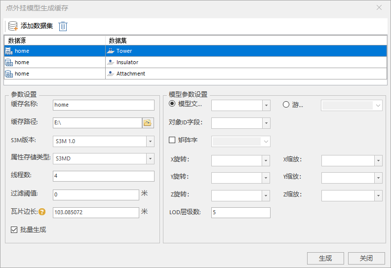

### 使用说明

点集生成缓存外挂模型是指具有相同材质、形状以及大小但仅空间位置和姿态不同的模型，采用模型只存一份，位置信息采用三维点数据集存储的方式存储多个模型数据集的模型统称。这样的方式与实例化有着异曲同工的用途，实现减少空间占用和数据量。

### 操作步骤

  1. 在工作空间管理器中，打开需要生成模型缓存的数据源。
  2. 在“ **三维数据** ”选项卡上“ **三维瓦片** ”组中，单击“ **生成缓存** ”下拉按钮，选择“ **点集生成缓存外挂模型**”按钮，弹出“点外挂模型生成缓存”对话框，如下图所示：     
  
 
  3. 添加模型数据集,单击**添加数据集**按钮，在打开的“选择”界面选择数据集。
  4. "选择"对话框界面左边区域内选择数据源，界面右边区域显示选中数据源内的所有模型数据集，单击“全选”或多选，确定添加的数据集，单击“确定”执行数据集添加操作，也可新建数据集作为添加数据集。
  5. 参数设置
      * **缓存名称** ：生成缓存的配置文件名，默认与数据源名一致，可修改。
      * **缓存路径** ：模型缓存存储路径，在该路径下创建了一个以缓存名称命名的文件夹存放缓存文件。
      * **S3M版本：** 支持两种S3M版本号，S3M1.0和S3M2.0，其中S3M2.0支持PBR材质。
      * **属性存储类型：** 支持两种属性存储类型，S3MD和ATTRIBUTE，提高属性文件的下载效率。其中S3MD的是以json的方式存储，ATTRIBUTE以二进制流的方式存储。
      * **线程数** ：默认为4。
      * **过滤阈值** ：过滤掉粗糙层较小的子对象，从而提升大场景数据的性能。 例如，过滤阈值设为2，则在最粗糙层过滤掉最长边小于2米的子对象，次粗糙层过滤掉小于1米的子对象，以此类推。最精细层子对象不过滤。
      * **瓦片边长** ：显示和设置瓦片边长的大小，单位为米。瓦片边长大小不同则对应的比例尺不同，将鼠标移至“瓦片边长”标签后的问号处，即可查看瓦片边长与比例尺、层级的对应关系。“瓦片边长”标识了缓存层相对于指定瓦片边长所对应的比例尺。
      * **批量生成** ：用于设置是否批量生成缓存，若勾选则批量生成缓存，即多个数据集生成一个缓存文件。
  6. 模型参数设置
      * **模型文件路径** ：记录模型文件路径的属性字段，这里的模型文件路径是绝对路径。
      * **游戏引擎资产路径** :记录游戏引擎资产文件路径的属性字段。
      * **对象ID字段** ：用于自行设置唯一标识ID的字段，通过下拉箭头进行选择。 
      * **矩阵设置** ：对模型旋转缩放的参数进行设置，有以下两种方式： 
        * 勾选“矩阵字段”复选框，指定数据的字段作为的旋转缩放的参数； 
        * 不勾选“矩阵字段”复选框，用户可自定义X/Y/Z旋转和缩放的参数。通过选择模型字段作为旋转或缩放的参数。
      * **LOD层级数** 。用于设置缓存的LOD层级数，在数值框中直接设置即可。 
  7. 设置完成后，单击“生成”按钮，执行缓存生成操作。其中 *.scp 为缓存配置文件，attribute.json为属性描述文件。

### 注意事项

  1. 瓦片边长决定了缓存根节点数量：边长越大，根节点越少；相反，边长越小，根节点越多，生成缓存时间更长。根节点数量过多时，加载模型将在一定程度上变慢。
  2. LOD层级数对模型显示时的切换平滑效果有影响：LOD层级数越大，模型显示时切换的效果越平滑；另一方面，LOD层级数设置过大，将导致生成冗余层级的模型，生成缓存耗费时间较长。请根据显示需求设置合理数值。
  3. 用于生成缓存的三维点数据集的属性表内的路径，一定是模型的绝对路径。否则将会生成失败！
  4. 所有属性字段名均为属性名称，而不是属性别名。

