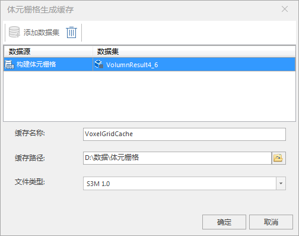

**使用说明**

　　“体元栅格叠加模型缓存”功能利用倾斜摄影配置文件来生成体元栅格缓存及SCP索引文件，方便在三维场景中加载该体元栅格缓存，实现体元栅格体数据浏览。支持在同一个模型文件上叠加多个体元栅格体，实现多业务表达。  
*注意*：体元栅格必须有[影像金字塔](../../../DataProcessing/DataManagement/DTr_CreatePyromid)才可以生成缓存。

**操作步骤**

  1. 在“ **三维数据** ”选项卡“ **三维瓦片缓存** ”组内的“ **生成缓存** ”下拉菜单中，单击“ **体元栅格叠加模型缓存** ”按钮，弹出“体元栅格-叠加生成缓存”，如下图所示。  
    
  2. 源数据选择，分别单击数据源和数据集后的组合框下拉按钮，选择生成缓存的体元栅格所在的数据集。
  3. 参数设置： 
       * 单击“模型文件(.scp)”右侧按钮，在弹出的“浏览文件夹”对话框中选择倾斜摄影配置文件，单击“打开”按钮即可；也可在文本框中直接输入倾斜摄影配置文件所在的文件夹路径及名称。
       * 在“缓存名称”后自定义缓存名。
  4. 设置完以上参数后，单击“确定”按钮，即可执行体元栅格生成缓存的操作。

 

