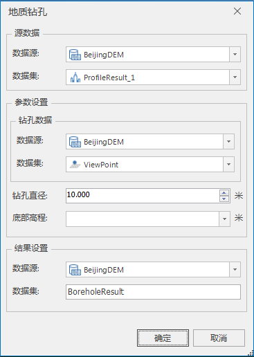

### 使用说明

“地质钻孔”功能，根据点数据集，通过设置钻孔参数，实现地质钻孔分析。地质钻孔分析中点数据集支持二维点和三维点。使用地质钻孔分析，可以自定义设置钻孔直径和钻孔高度，实时获得不同钻孔参数的分析结果。

### 操作步骤

  1. 打开地质钻孔功能。单击“ **三维数据** ”选项卡中“ **模型** ”组中 **地质体** 下拉按钮，在弹出的下拉菜单中选择“地质钻孔”项。弹出的对话框如下：  
  

      * 源数据：选择需要进行地质钻孔分析的地质体数据集。
      * 钻孔数据：选择钻孔数据集。
      * 参数设置：设置钻孔直径和底部高程。
      * 结果设置：设置结果数据存储的数据源和数据集。数据集名称默认为BoreholeResult，可自定义输入名称。
  2. 点击“确定“进行地质钻孔分析。

### 注意事项

  1. 钻孔点数据集同时支持二维点和三维点。

