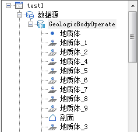
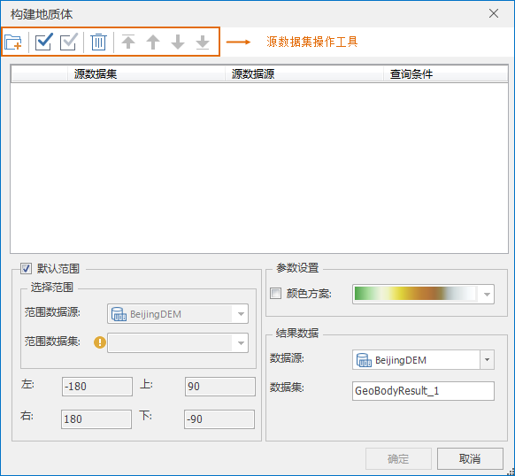
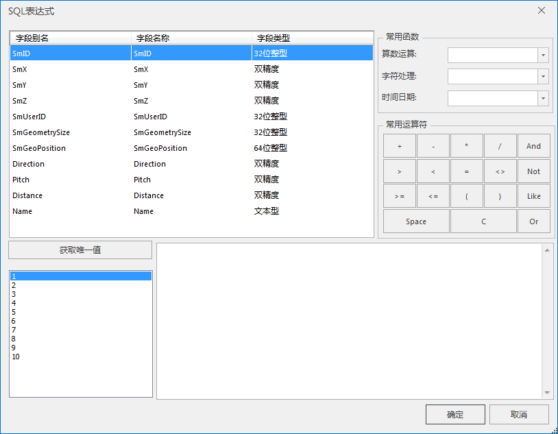
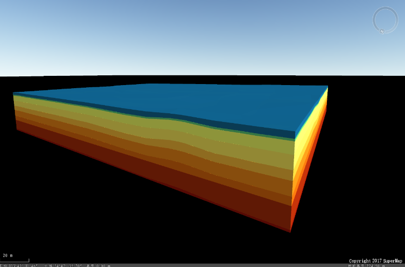

**使用说明**

　　“地质体构建”功能，依据多个地质点数据集实现对地质体的构建。该方法实现对复杂地质体的快速建模和可视化，可以有效用于地质调查分析。

**操作步骤**

  1. 加载数据源。数据源需要包含地质点数据集，示例数据源如下：  
    
  2. 新建一个球面场景。在工作空间管理器中右键单击“场景”，选择 “新建球面场景”。
  3. 打开地质体构建窗口。单击“ **三维数据** ”选项卡中“ **模型** ”组中 **地质体** 下拉按钮，在弹出的下拉菜单中选择“地质体构建”。加载源数据集后的构建地质体对话框如下：  
    
       * 源数据集操作工具：依次是添加源数据集、全选源数据集、反选源数据集、移除选择的数据集、数据集排序（置顶、上移、下移、置底）。构建地质体中点图层的顺序对应实际地层由高到低，导入数据集后，通过数据集排序工具进行修改顺序。
       * 查询条件：用来从已有的点数据集中查询出满足特定条件的数据参与地质体构建，数据鼠标单击右侧按钮，弹出“SQL表达式”对话框，如图所示。“SQL表达式”对话框内的参数设置可参考[通过SQL语句进行查询](../../../Query/SQLQueryDia  )。  
   
       * 结果范围：选择指定范围的数据源和数据集，其中选择的数据集必须与地质点数据集投影一致，同时可以自定义上下左右的范围数值。如果不进行设置，则使用默认范围。
       * 参数设置：勾选颜色方案选项框，在配色下拉列表框中选择需要的配色方案。
       * 结果数据：设置结果数据存储的数据源和数据集。
  4. 点击“确定“进行地质体构建，示例构建结果如下：  
  

**注意事项**  
  1. 构建地质体支持投影坐标系的数据。

 

