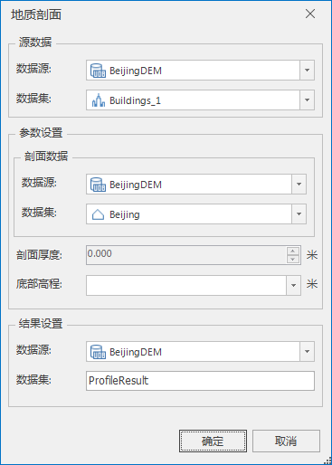
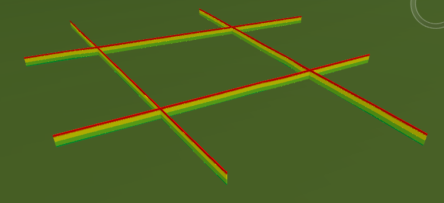

**使用说明**

　　“地质剖面分析”功能，根据剖面数据集，提取获得指定剖面的地质模型。剖面数据集支持二维线、二维面、三维线和三维面。使用地质剖面分析，可以自定义设置剖面厚度和剖面高度，实时获得不同剖面的分析结果。

**操作步骤**

  1. 打开地质剖面分析功能。单击“ **三维数据** ”选项卡中“ **模型** ”组中 **地质体** 下拉按钮，在弹出的下拉菜单中选择“地质剖面”项。弹出的对话框如下：  
     
       * 源数据：选择需要进行地质剖面分析的地质体数据集。
       * 参数设置 
         * 剖面数据：选择目标数据集，可以是二维面或二维线或三维线或三维面。
         * 剖面厚度：当目标数据选取的是面时，剖面厚度不可改；当目标数据选取的是线，可以修改剖面厚度。鼠标单击右侧上下按钮进行数值设置，也可以直接输入需要的数值。
         * 底部高程：鼠标单击右侧下拉按钮选择。
       * 结果设置：设置结果数据存储的数据源和数据集。数据集名称默认为ProfileResult，可自定义输入数据集名称。
  2. 点击“确定“进行地质剖面分析，二维线作为目标数据集的分析结果如下：

  

 

