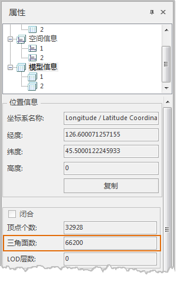
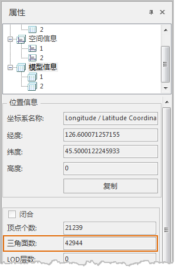

**使用说明**

　　移除重复面是批量去除多个数据集中的模型对象的重复或无效三角面，精简模型数据，降低内存的占用，满足大体量数据的性能需要。

**操作步骤**

  1. 在工作空间管理器中右键单击“数据源”，选择 “打开文件型数据源”，打开包含BIM模型数据集的数据源。
  2. 单击“ **三维数据** ”选项卡中“ **模型** ”组中" **模型校正** "下拉按钮，在弹出的下拉菜单中选择“ **移除重复面** ”，弹出“移除重复面”对话框。
  3. 添加数据集：单击“添加数据集”按钮，在弹出的选择对话框中选择或新建模型数据集。
  4. 另存结果数据集：设置是否将结果数据另存为结果数据集，默认勾选。若不勾选，则结果数据将会覆盖源数据。
  5. 参数设置完成，单击“确定”。移除重复面后在原数据源生成新的数据集。
  6. 在场景中查看移除重复三角面模型对象的属性，在模型信息下可以看到三角面个数的改变，如下图所示：  
       
  
 

 

