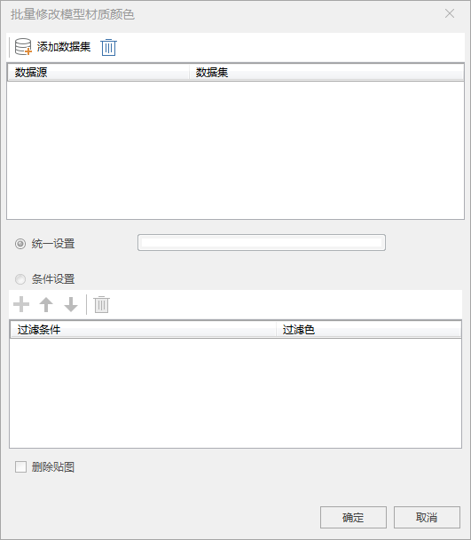
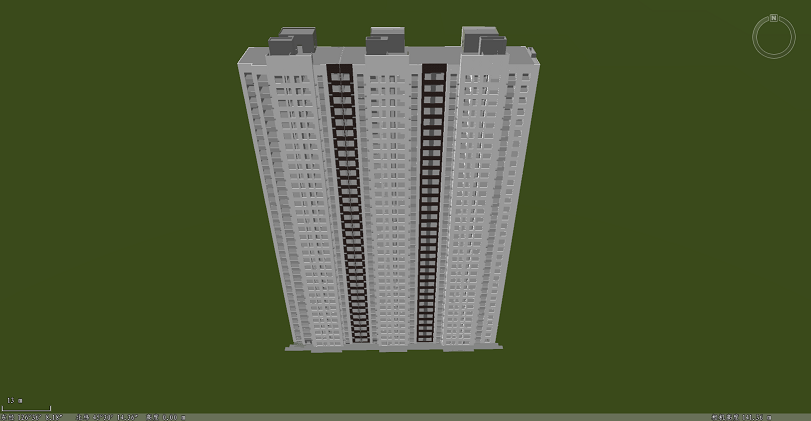
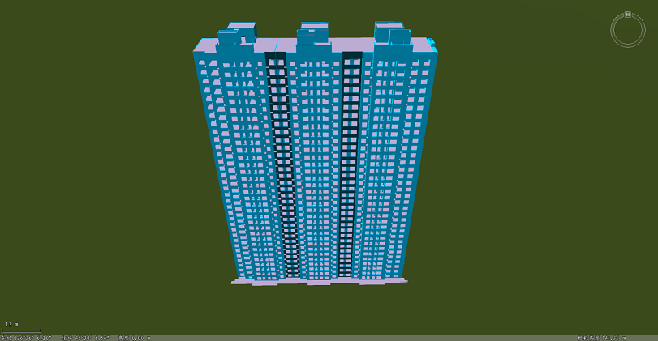

### 使用说明

批量修改模型材质颜色， 提供统一设置和条件设置两种方式，条件设置支持根据过滤条件分别设置满足某一条件的一类模型的材质颜色。

### 操作步骤

  1. 打开保存有需要进行修改材质颜色的模型数据的数据源。
  2. 在“ **三维数据** ”选项卡>“ **模型** ”组中>单击“ **模型处理** ”下拉按钮，选择“批量修改模型材质颜色”，弹出如下对话框：
  
 
  3. 添加模型数据集,单击**添加数据集**按钮，在打开的“选择”界面选择数据集。
  4. 勾选“统一设置”，单击统一设置后的颜色框，弹出颜色表，支持直接选选择颜色或者通过拾色器设置或者直接设置R、G、B、A值将所有模型的材质颜色统一设置为某一颜色。
  5. 条件设置：勾选“条件设置”
      * 单击**添加**按钮，添加过滤条件和过滤色。
      * 单击过滤条件后的按钮，弹出SQL表达式，构建批量修改模型材质颜色过滤条件。具体操作请参见[构建SQL查询的函数说明](../../../Query/SQLQueryFunction)
      * 过滤条件的优先级从上至下逐层递增，最下层过滤条件优先级最高，支持通过**上移**和**下移**按钮调整过滤条件排序。
  6. 删除贴图：勾选“删除贴图”，将模型原有的贴图删除，可避免贴图颜色与设置的过滤颜色叠加后颜色混合。
  7. 点击“确定”按钮完成批量修改模型材质颜色。
|      

### 注意事项

  1. 条件设置的过滤条件优先级从上至下逐级递增，最底层的过滤条件优先级最高。可以通过上移和下移来调整优先级。

