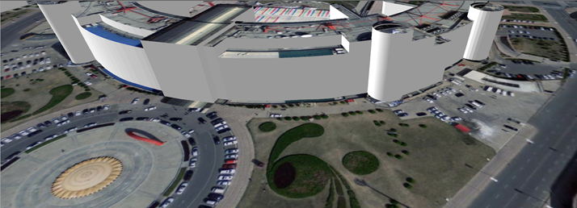

**使用说明**

　　由于地形是高低起伏的，而模型底部是平整的，位于同一高度，导致模型和地形不能够严格贴合，出现模型的一部分被掩埋或者漂浮于地形之上，不能达到理想的真实效果。  
　　地形模型匹配根据地形栅格值，修改模型定位点；选择模型数据集及栅格数据集，执行生成新的模型数据集。

**操作步骤**

1. 打开保存有需要进行匹配的地形数据（DEM 栅格数据）和模型数据的数据源。
2. 在“ **三维数据** ”选项卡上“ **模型** ”组中，单击“ **地形修改模型** ”按钮，弹出“地形修改模型”对话框。
3. 在源数据栏中，选择需要进行匹配的地形数据（DEM栅格数据集）和模型数据（模型数据集）。
4. 在结果数据栏，选择数据源保存新生成的模型数据集，在数据集右侧文本框中输入一段字符串作为新生成模型数据集的名称。
5. 点击“确定”按钮完成地形模型的匹配。将DEM 栅格数据（地形数据）和新生成的模型数据添加到场景中，浏览地形模型匹配后的效果。    
  
  
**注意事项**

 1. 由CAD转模型数据集所得的模型不能正确与地形匹配。
 2. 目前只支持独立的模型对象与地形正确匹配。

 

