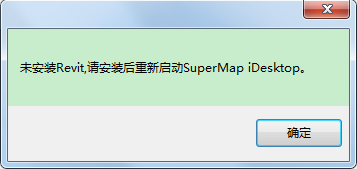

**使用说明**  
　　“导入RVT”命令，用来导入Revit的rvt格式的BIM数据，并在数据源中新增模型数据集节点。

**操作步骤**

  1. 在工作空间管理器中选中需导入到的数据源 ，或者新建数据源并选中。
  2. 单击“ **三维数据** ”选项卡中“ **模型** ”组内“ **BIM** ”下拉菜单中的“ **导入RVT** ”按钮，弹出“导入RVT文件-Revitxxxx”对话框，这里的“xxxx”是指Revit的版本号。
  3. 通过"添加"按钮，在弹出的“打开”对话框中选择需要导入的RVT数据。
  4. 文件列表显示了当前打开的所有RVT文档
       * 文件列表内的默认全部导出，可通过勾选某一文档前的复选框，选择是否导入该数据。
       * 文档设置：单击文档后的文档设置按钮，弹出“RVT文档设置”对话框。
         * 文件列表显示了当前打开的文档的可供导出族，默认全部导出，可选择是否勾选族前的复选框进行部分导出。
         * 视图:选择导出模型的视图，默认为三维视图。视图与过滤色绑定，决定打开模型的材质颜色。
  5. 基本设置:
       * 模型定位点：模型导入时的位置，用一个三维点对象表示。默认定位点为（0,0,0）。 
       * 投影设置：支持投影设置和导入投影文件两种方式设置投影坐标系，详细操作步骤请参见“[设置投影坐标系](../../DataProcessing/Projection/PrjCoordSysDia  )”。
       * 颜色设置：提供着色颜色和真实颜色两种颜色模式。
       * 真实模式有贴图只保留贴图不要颜色，没有贴图保留颜色
       * 着色模式不考虑贴图只留颜色
       * 高级选项：
          * 导出LOD：设置导出后的模型是否带LOD，默认勾选。
          * 实例化：设置的模型是否以实例化形式存储，默认勾选以防止数据膨胀。
          * 拓扑闭合：设置模型是否拓扑闭合，默认勾选。
          * 过滤色：导出模型的颜色以过滤色为最高优先级，如果满足过滤条件则赋予过滤色，有过滤色则没有贴图,否则为着色或真实颜色。默认勾选导出带过滤色。
          * 导出体量：设置是否导出Revit中房间/建筑的体量族。
          * LOD精细度：当勾选导出LOD时，进行LOD简化百分比设置，设置范围为0-100%。
          * 导出明细表：设置是否导出Revit明细表。若勾选则导出Revit文件的明细表，导出后以属性表数据集格式呈现。
          * 导出二维视图：设置是否导出Revit二维视图，若勾选则导出Revit文件的视图。导出后，在生成的UDB数据同级目录下生成相应文件夹，文件夹内为DWG文件，即导出的二维视图以CAD数据集格式呈现。
          * 最大读写数：针对大体量复杂数据内存暴涨情况，默认读写数为最大值500，可根据数据情况自定义大小。
  6. 文件信息：包含文件路径、文件版本、用户名以及模型预览等内容。其中，用户名是[协同设计](../3DDesigner/CollaborativeDesign/CollaborativeDesignDia)时的相关信息。
  7. 单击“确定”按钮，执行“导入RVT”。完成后工作空间管理器中的数据源下新增一个RVT数据节点。  
　　在场景中加载导入的RVT格式数据，如下图所示：  
  

**注意事项**  
  1. 特别说明，“导入RVT”功能依赖.NET Framework 4.7版本及以上。
  2. “导入RVT”功能是依赖于Revit软件的。如果当前电脑没有安装Revit软件，那么当执行“导入RVT”功能时，会弹出如下提示对话框。  
  
  1. 若当前电脑安装了多个版本的Revit软件，默认选择当前电脑上安装的最高版本；可根据需求在安装包中，修改桌面参数文件内Revit版本参数，自定义指定具体版本。目前支持的版本有Revit2016-2019。
  2. 由于Revit版本不同，生产数据的版本也会不同。因此若导入RVT文件的版本高于当前电脑安装的软件版本时，将无法导入，并且会在输出窗口显示错误提示信息。
  3. 小体量RVT数据建议使用“打开RVT”功能，因为该功能一次只能打开一个文件；大体量RVT数据建议使用“导入RVT“功能，因为该功能一次可以导入多个文件。

**相关主题**  
[打开BIM数据](OpenBIM)  
[导入3DXML](Import3DXML)  
[导入IFC](../3DTools/ModelData/ImportIFC)

 

