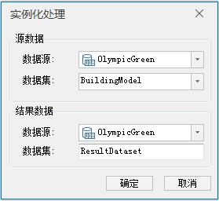

**使用说明**

　　模型数据集重新以实例化方式存储。

**操作步骤**

1. 在工作空间管理器中，打开需要进行实例化处理的模型数据集所在的数据源。
2. 在“ **三维数据** ”选项卡下的“ **模型** ”组中“ **模型处理** ”下拉按钮中，单击“ **实例化处理** ”按钮，如下图所示，并弹出“实例化处理”对话框。  
    
 3. 选择对应的源数据及结果数据，点击“确定”按钮完成实例化处理。 
      * 源数据：选择需要进行实例化处理的模型数据集及所在数据源。
      * 结果数据：选择工作空间内打开的数据源保存以数据集名称命名的模型数据集。

 

