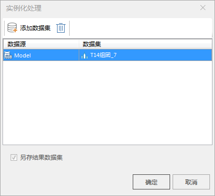

### 使用说明

模型数据集重新以实例化方式存储。实例化处理支持一次性处理多个模型数据集。

### 操作步骤

1. 在工作空间管理器中，打开需要进行实例化处理的模型数据集所在的数据源。
2. 在“ **三维数据** ”选项卡下的“ **模型** ”组中“ **模型工具** ”下拉按钮中，单击“ **实例化处理** ”按钮，如下图所示，并弹出“实例化处理”对话框。

  

3. 单击“添加数据集”按钮，在弹出的对话框中选择待处理的数据集，点击“确定”按钮完成实例化处理。默认另存数据集且不可修改。 

