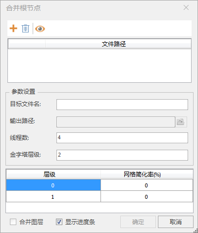
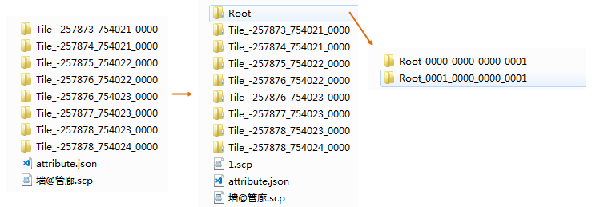

### 使用说明

“合并根节点”功能适用于精模缓存，且缓存文件类型仅支持S3M和S3MB，是将相邻一定空间范围的根节点合并为一个根节点，即向上抽稀生成了一层更为粗糙的LOD层级，每合并一次，模型根节点数量减少约为原始数量的1/4。

### 操作步骤

1. 单击“ **三维数据** ”选项卡中“ **三维瓦片** ”组中“ **缓存工具** ”下拉按钮中的" **模型缓存合并根节点** "按钮，弹出“合并根节点”对话框。
  

2. **添加**按钮，在打开的界面选择进行合并根节点操作的模型缓存文件。； **删除**按钮，用于删除列表中的文件；**显示文件全路径**按钮，用于设置是否显示配置文件的绝对路径。
3. 目标文件名：生成结果数据的文件的名称。
4. 输出路径：模型缓存存储路径，在该路径下创建了一个以缓存名称命名的文件夹存放缓存文件，勾选“合并图层”后才可修改输出路径。
5. 线程数：分配给合并根节点操作的线程数，默认为4个线程参与操作，用户可自定义线程数。 
6. 金字塔层级数：用于设置根节点合并次数。如输入1，即模型根节点将进行一次合并处理。
7. 网格简化率：表示模型显示的细节按照百分比进行简化，仅对重新生成的根节点做简化，原始数据不更改。
8. 合并图层：可选，勾选“合并图层”后，可将多个配置文件生成一个配置文件，即将多个模型图层合并到一个模型图层中。当列表中的配置文件个数大于或等于2时，“合并图层”按钮才可用。
9. 显示进度条：可选，勾选“显示进度条”后，可查看合并进度。

   本案例的数据经合并处理后，8个根节点被合并，生成了2个新的根节点，则在目标文件夹下新生成了一个scp配置文件(1.scp)及一个根节点文件夹(Root)，内含2个根节点文件，SCP配置文件记录了合并后模型对应的根节点名称，下图为合并根节点操作前后结果对比 。

  

  

