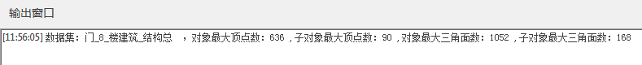

### 使用说明

模型检查是查看模型对象和子对象的最大顶点数和最大三角面数的数据信息。

### 操作步骤

1. 在工作空间管理器中右键单击“数据源”，选择 “打开文件型数据源”，打开包含BIM模型数据集的数据源。
2. 单击“ **三维数据** ”选项卡中“ **模型** ”组中" **模型工具** "下拉按钮，在弹出的下拉菜单中选择“ **模型检查** ”，弹出“模型检查”对话框。
3. 添加数据集：单击“添加”按钮，在弹出的选择对话框中选择或新建模型数据集。
4. 子对象检查：设置是否将子对象参与检查，默认勾选，不可改。
5. 单击“确定”，模型检查完成后，会在输出窗口输出：完成时间、模型数据集名称、对象最大顶点数、子对象最大顶点数、对象最大三角面数及子对象最大三角面数。
  

  

